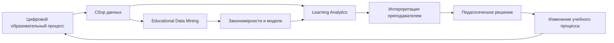
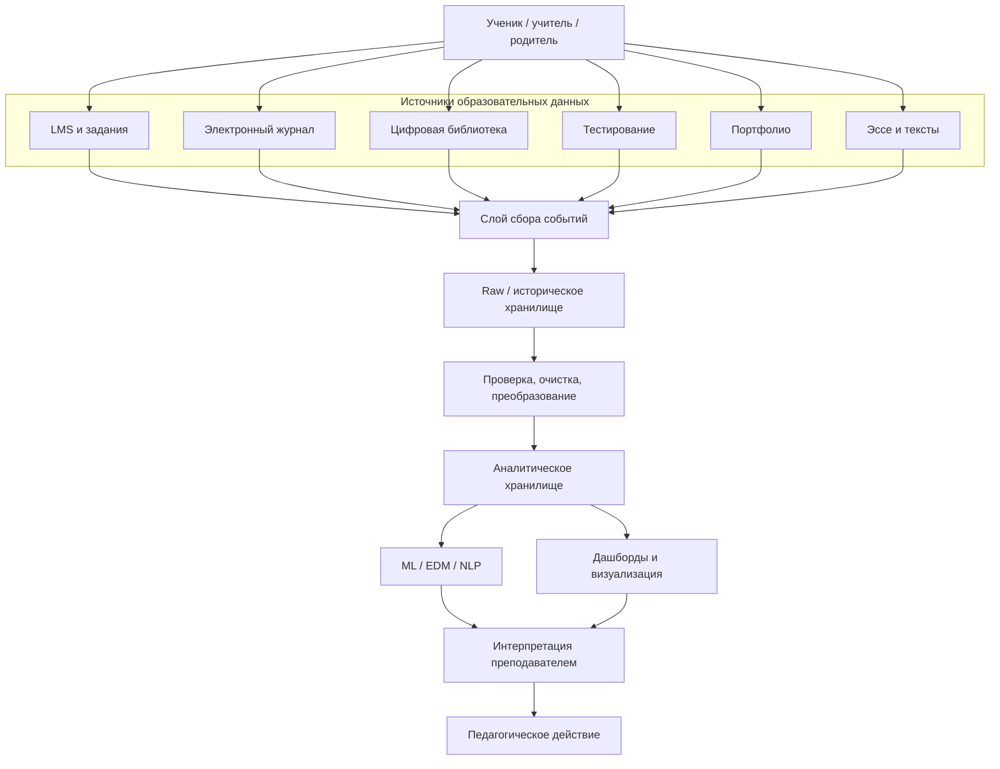
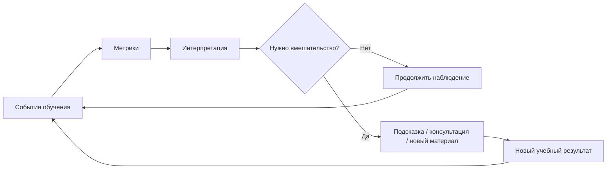

# К.М.06.04 «Методы анализа больших данных»

**Направление подготовки:** 44.03.05 «Педагогическое образование (с двумя профилями подготовки: Информатика и английский язык)»  
**Уровень:** бакалавриат  
**Назначение:** теоретическая основа для лабораторных и практических работ по анализу образовательных данных, машинному обучению и обработке англоязычных текстов.

---

# Этап 1. Аналитическая справка по актуальным научным трендам

## Executive Summary

**Актуализация научной базы:** по состоянию на август 2026 г.

Современное исследовательское поле анализа образовательных данных развивается на пересечении **Educational Data Mining (EDM)**, **Learning Analytics (LA)**, машинного обучения, цифровой педагогики и обработки естественного языка. В актуальных исследованиях заметен переход от простого накопления цифрового следа и построения описательных отчетов к замкнутому циклу: сбор данных → интерпретация → педагогическое решение → вмешательство → оценка эффекта. Одновременно расширяется состав данных: кроме журналов LMS анализируются тексты, аудио, видео, данные о взаимодействии с цифровыми ресурсами и другие модальности.

Для дисциплины «Методы анализа больших данных» принципиально важно не сводить Big Data к размеру таблиц. В образовательном контексте большие данные возникают прежде всего из сочетания высокой событийности, разнообразия источников, динамичности и необходимости быстро получать педагогически интерпретируемый результат.

По итогам анализа современных публикаций в содержание мини-лекций включаются шесть ключевых концепций.

### 1. Сближение EDM и Learning Analytics в рамках Educational Data Science

EDM традиционно сильнее ориентирован на вычислительные методы обнаружения закономерностей, тогда как LA делает больший акцент на интерпретации данных для поддержки обучающихся, преподавателей и образовательных организаций. Современные обзоры показывают, что граница между направлениями становится менее жесткой. Поэтому для учебных целей целесообразно рассматривать их как взаимодополняющие компоненты **Educational Data Science**.

Практический вывод для курса: студент должен уметь не только построить модель, но и ответить на три вопроса:

1. Какое педагогическое решение поддерживает модель?
2. Насколько результат интерпретируем?
3. Можно ли проверить, улучшило ли применение модели образовательный результат?

### 2. Closed-loop Learning Analytics: аналитика как цикл обратной связи

Современная Learning Analytics постепенно переходит от статичной визуализации к **замкнутому аналитическому циклу**. Недостаточно обнаружить, что ученик редко входит в LMS или имеет высокий риск невыполнения задания. Аналитика становится педагогически значимой только тогда, когда сигнал приводит к обоснованному действию: консультации, изменению сложности задания, дополнительному материалу, обратной связи или корректировке образовательной траектории.

Обобщенная схема:

$$
Data \rightarrow Information \rightarrow Insight \rightarrow Intervention \rightarrow Outcome \rightarrow New\ Data
$$

То есть новый результат обучения вновь становится частью цифрового следа и позволяет проверить эффективность вмешательства.

### 3. Multimodal Learning Analytics и принцип минимально необходимого сбора

**Multimodal Learning Analytics (MMLA)** объединяет несколько потоков данных: события LMS, текст, аудио, видео, данные взаимодействия с интерфейсом, иногда сенсорные или физиологические сигналы. Мультимодальность дает более полное представление об учебном процессе, но повышает риск чрезмерного наблюдения.

Современный методический принцип состоит не в том, чтобы «собрать всё, что можно», а в том, чтобы собирать **минимально необходимый набор признаков**, непосредственно связанный с педагогической задачей. Обзоры 2025–2026 гг. дополнительно выделяют интеграцию ИИ и генеративных моделей в MMLA, но одновременно подчеркивают проблемы шума, пропусков, масштабирования, приватности, прозрачности и ответственного развертывания таких систем.

### 4. От предсказания риска к Explainable and Responsible Learning Analytics

Системы раннего предупреждения (**Early Warning Systems**) используют классификацию и прогнозирование для выявления обучающихся, которым может потребоваться поддержка. Однако высокая Accuracy сама по себе недостаточна.

Современная постановка задачи включает:

- Precision и Recall для класса риска;
- устойчивость модели на разных потоках и учебных годах;
- контроль дрейфа данных;
- анализ ошибок для разных групп;
- интерпретируемость факторов риска;
- обязательное участие преподавателя в принятии решения.

Методы XAI, в частности SHAP и LIME, применяются для объяснения вклада признаков. При этом объяснение модели не должно восприниматься как доказательство причинности: модель может показать связь между низкой активностью и риском, но не установить педагогическую причину этой связи.

### 5. NLP в лингводидактике: от частотных признаков к контекстным представлениям

В анализе англоязычных учебных текстов сохраняют значение классические методы:

- токенизация;
- лемматизация;
- частотный анализ;
- TF-IDF;
- LDA.

Однако современные исследования дополняют их:

- контекстными эмбеддингами;
- трансформерными моделями;
- BERTopic и другими embedding-based topic models;
- более сложными моделями readability;
- Automated Essay Scoring как инструментом поддержки эксперта, а не полной замены преподавателя.

### 6. Privacy-by-Design, fairness и управление образовательными данными

Образовательные данные могут содержать сведения о несовершеннолетних, успеваемости, поведении и индивидуальной образовательной траектории. Поэтому проектирование аналитики должно начинаться не с выбора алгоритма, а с определения допустимой цели обработки.

В российском контексте базовым нормативным ориентиром является Федеральный закон № 152-ФЗ «О персональных данных». Для сравнительного анализа международной практики полезны GDPR и COPPA.

В учебном курсе используются следующие принципы:

- законность и определенность цели;
- минимизация данных;
- ограничение сроков хранения;
- разграничение доступа;
- псевдонимизация и обезличивание там, где это возможно;
- прозрачность аналитических решений;
- аудит ошибок и возможной алгоритмической предвзятости;
- запрет автоматического навешивания педагогических «ярлыков» на обучающегося.

---

# Лекция 1. Концепция Big Data и Learning Analytics в образовании

## Цель и планируемые результаты

### Цель

Сформировать системное представление о Big Data в образовательной среде, показать связь больших данных с Educational Data Mining и Learning Analytics, рассмотреть структуру цифрового следа обучающегося и базовые принципы этичного и безопасного использования данных.

### Планируемые результаты

После изучения мини-лекции студент способен:

- объяснять особенности больших данных в образовательных системах;
- характеризовать образовательные данные по модели 5V;
- выявлять источники цифрового следа в LMS и цифровых образовательных платформах;
- различать EDM, Learning Analytics и Educational Data Science;
- проектировать концептуальную архитектуру сбора и анализа учебных данных;
- оценивать необходимость сбора отдельных категорий данных;
- учитывать требования защиты персональных данных при постановке аналитической задачи;
- объяснять обучающимся принципы ответственного использования цифрового следа.

## Big Data: от «большого файла» к инфраструктуре принятия решений

Под **Big Data** понимают данные и способы их обработки, для которых существенны не только объем, но и скорость возникновения, разнообразие форматов, качество и ценность получаемых результатов.

В образовании большие данные могут формироваться из:

- электронного журнала;
- LMS;
- цифрового дневника;
- платформ тестирования;
- библиотек цифрового контента;
- систем видеоконференций;
- онлайн-курсов;
- результатов олимпиад и диагностик;
- текстов эссе;
- форумов и чатов;
- цифровых лабораторий;
- программных тренажеров;
- автоматических проверяющих систем.

Одна строка журнала оценок еще не является Big Data. Проблема больших данных появляется, когда образовательная система должна регулярно связывать миллионы событий, поступающих из разных источников, проверять их качество и превращать в интерпретируемые показатели.

## Модель 5V

Наиболее распространенное учебное представление Big Data строится вокруг модели **5V**.

| Компонент | Смысл | Образовательный пример |
|---|---|---|
| **Volume** | объем | миллионы событий LMS за учебный год |
| **Velocity** | скорость | поступление событий во время онлайн-урока или теста |
| **Variety** | разнообразие | оценки, JSON-события, тексты, аудио, изображения |
| **Veracity** | достоверность | ошибки журналирования, пропуски, дубли, некорректные временные метки |
| **Value** | ценность | возможность вовремя обнаружить трудность и оказать поддержку |

Количество событий за период можно выразить как:

$$
N_{\text{events}}=\sum_{i=1}^{n} e_i,
$$

где $e_i$ — число зарегистрированных событий для $i$-го обучающегося.

Средняя интенсивность потока событий:

$$
\lambda=\frac{N_{\text{events}}}{T},
$$

где $T$ — рассматриваемый интервал времени.

Для учителя важен вывод: большой объем данных имеет смысл только при наличии педагогической цели.

## Educational Data Mining и Learning Analytics

**Educational Data Mining (EDM)** — направление, связанное с разработкой и применением методов интеллектуального анализа данных для обнаружения закономерностей в образовательных данных.

**Learning Analytics (LA)** — сбор, измерение, анализ и представление данных об обучающихся и учебном контексте с целью понимания и оптимизации обучения.

Упрощенно различие можно представить так:

- EDM спрашивает: **«Какие закономерности можно обнаружить в данных?»**
- LA спрашивает: **«Как использовать эти закономерности для улучшения обучения?»**

Современный подход можно описать как **Educational Data Science**, объединяющий статистику, Data Mining, машинное обучение, визуализацию, педагогическую интерпретацию, управление данными, этику и безопасность.

## Цифровой след обучающегося

**Цифровой образовательный след** — совокупность данных, возникающих в результате взаимодействия обучающегося с цифровой образовательной средой.

Полезно разделять его на несколько уровней.

### Результативный след

- оценка;
- балл;
- правильность ответа;
- результат теста;
- достижение образовательного результата.

### Процессный след

- число попыток;
- время выполнения;
- последовательность действий;
- обращения к подсказкам;
- просмотр материалов;
- возвраты к предыдущим разделам.

### Коммуникационный след

- сообщения форума;
- вопросы преподавателю;
- групповые обсуждения;
- взаимное рецензирование.

### Текстовый и языковой след

- эссе;
- ответы открытого типа;
- переводы;
- аннотации;
- письменные отзывы;
- лексические и грамматические характеристики текста.

### Мультимодальный след

**Multimodal Learning Analytics** может дополнительно использовать аудио, видео, траекторию взаимодействия с интерфейсом, данные цифрового пера и сенсоров. Увеличение числа модальностей не означает автоматического повышения качества анализа: каждый источник должен быть педагогически оправдан.

## Архитектура сбора образовательных данных

Для учебных целей архитектуру LMS или платформы уровня МЭШ целесообразно рассматривать как логическую модель. Это **не описание внутренней закрытой технической архитектуры МЭШ**, а типовая схема, применимая к цифровой образовательной платформе.

Официальные материалы МЭШ показывают, что единый цифровой контур объединяет, в частности, электронный журнал и дневник, библиотеку образовательных материалов и цифровое портфолио. С точки зрения анализа данных эти сервисы можно рассматривать как независимые источники событий.

## Learning Analytics как замкнутый цикл

Аналитика становится педагогической только тогда, когда результат может изменить образовательное действие и затем проверить эффект этого изменения.

## Этика и защита образовательных данных

### Российский контекст

При работе с персональными данными необходимо учитывать Федеральный закон от 27.07.2006 № 152-ФЗ «О персональных данных» в актуальной редакции.

В образовательном проекте заранее определяются:

- цель обработки;
- состав данных;
- основание обработки;
- круг пользователей, имеющих доступ;
- срок хранения;
- процедура удаления или обезличивания;
- меры защиты.

### GDPR и COPPA как сравнительные модели

**GDPR** устанавливает специальные гарантии обработки данных детей. **COPPA** в США регулирует сбор персональной информации онлайн у детей младше 13 лет; обновленные правила усиливают требования к согласию, передаче данных третьим лицам и срокам хранения.

Эти документы рассматриваются в курсе не как нормы российского права, а как примеры международных подходов к защите детских данных.

### Минимизация данных

Пусть полный набор доступных признаков:

$$
X=\{x_1,x_2,\ldots,x_m\}.
$$

Следует выбрать минимально необходимое подмножество:

$$
X^* \subseteq X,
$$

такое, что качество педагогически значимого решения остается достаточным:

$$
Q(X^*) \geq Q_{\min}.
$$

## Алгоритмическая предвзятость

**Algorithmic bias** — систематическое различие ошибок или результатов алгоритма для разных групп пользователей.

Предвзятость может возникнуть из-за исторически несбалансированных данных, различий в доступе к устройствам, языковых особенностей, пропусков, неверно выбранной целевой переменной или косвенных признаков.

Корректная педагогическая формулировка: «По текущему набору признаков модель показывает повышенную вероятность затруднения; требуется педагогическая проверка».

Некорректная формулировка: «Этот ученик не способен освоить предмет».

## Ключевые понятия

- Big Data;
- 5V;
- Educational Data Mining;
- Learning Analytics;
- Educational Data Science;
- цифровой образовательный след;
- Multimodal Learning Analytics;
- closed-loop analytics;
- data minimization;
- Privacy-by-Design;
- algorithmic bias.

## Дидактический практикум: как объяснить тему школьникам 10–11 классов

### Учебная ситуация

Предложить школьникам представить обычный электронный дневник как источник данных. За неделю фиксируются дата, предмет, оценка, факт сдачи домашнего задания, число попыток и длительность работы.

### Задание 1. Найти 5V

Школьники сопоставляют Volume, Velocity, Variety, Veracity и Value с данными электронного дневника.

### Задание 2. «Можно ли собирать всё?»

Предлагаются потенциальные признаки: оценка, время сдачи, текст ответа, геолокация, запись камеры, любимая музыка, число попыток. Учащиеся определяют, какие из них действительно нужны для задачи «предсказать вероятность несдачи домашнего задания в срок».

### Интеграция с английским языком

Термины: `learning analytics`, `digital footprint`, `data privacy`, `fairness`, `student engagement`.

Школьники формулируют короткие английские определения и обсуждают, какие сведения о себе они считают чувствительными.

### Методический результат

Ученик должен понять две идеи:

1. данные могут помогать учителю принимать решения;
2. возможность собрать данные еще не означает право или необходимость их собирать.

## Рекомендуемые источники

1. Cerezo R., Lara J.-A., Azevedo R., Romero C. *Reviewing the differences between learning analytics and educational data mining: Towards educational data science*. Computers in Human Behavior. 2024. Vol. 154. Article 108155. DOI: https://doi.org/10.1016/j.chb.2024.108155
2. Sailer M. et al. *The End is the Beginning is the End: The closed-loop learning analytics framework*. Computers in Human Behavior. 2024. Vol. 158. Article 108305. DOI: https://doi.org/10.1016/j.chb.2024.108305
3. Ouhaichi H., Spikol D., Vogel B. *Research trends in multimodal learning analytics: A systematic mapping study*. Computers and Education: Artificial Intelligence. 2023. Vol. 4. Article 100136. DOI: https://doi.org/10.1016/j.caeai.2023.100136
4. Prinsloo P., Slade S., Khalil M. *Multimodal learning analytics—In-between student privacy and encroachment: A systematic review*. British Journal of Educational Technology. 2023. Vol. 54, No. 6. P. 1566–1586. DOI: https://doi.org/10.1111/bjet.13373
5. Огоев А. У., Хаблиева С. Р. Анализ цифрового следа как средство повышения качества подготовки студентов // Азимут научных исследований: педагогика и психология. 2023. Т. 12. № 4(45). URL: https://cyberleninka.ru/article/n/analiz-tsifrovogo-sleda-kak-sredstvo-povysheniya-kachestva-podgotovki-studentov
6. Федеральный закон от 27.07.2006 № 152-ФЗ «О персональных данных». Официальный интернет-портал правовой информации: https://pravo.gov.ru/

---
