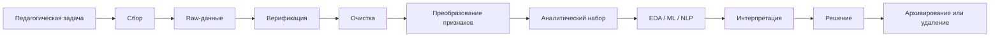
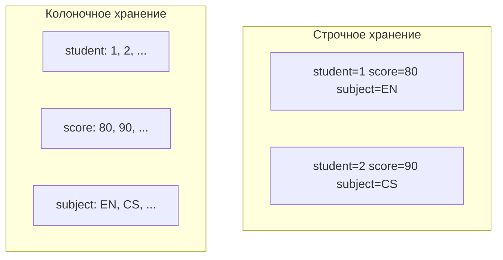
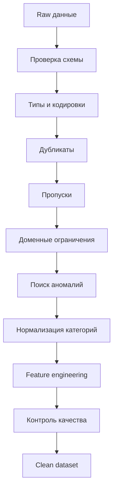

# Лекция 2. Жизненный цикл учебных данных: сбор, верификация и предобработка

## Цель и планируемые результаты

### Цель

Сформировать представление о жизненном цикле образовательных данных и научить связывать качество исходных данных с надежностью аналитического результата.

### Планируемые результаты

После изучения мини-лекции студент способен:

- выбирать формат хранения данных в зависимости от структуры и сценария использования;
- различать CSV, JSON и Parquet;
- обнаруживать пропуски, дубли, аномальные и противоречивые записи;
- проектировать конвейер верификации и очистки;
- вычислять базовые показатели качества данных;
- объяснять влияние качества данных на результаты ML и Learning Analytics;
- формулировать правила обработки данных до этапа моделирования.

## Жизненный цикл образовательных данных

Типичный жизненный цикл включает:

1. постановку педагогической задачи;
2. сбор;
3. регистрацию происхождения;
4. верификацию;
5. очистку;
6. преобразование;
7. объединение;
8. анализ;
9. интерпретацию;
10. хранение или удаление.



Критически важно сохранять исходный слой `raw` отдельно от очищенных данных. Это делает анализ воспроизводимым.

## Форматы данных

### CSV

**CSV (Comma-Separated Values)** — табличный текстовый формат.

Пример:

```text
student_id,subject,score,attempts
S001,English,82,2
S002,Informatics,91,1
```

Преимущества:

- простота;
- читаемость;
- поддержка большинством аналитических инструментов.

Недостатки:

- нет строгой схемы типов;
- возможны проблемы кодировки;
- неоднозначность разделителей;
- вложенные структуры неудобны.

### JSON

**JSON (JavaScript Object Notation)** подходит для событийных и вложенных данных.

```json
{
  "student_id": "S001",
  "event": "quiz_attempt",
  "course": "English",
  "result": {
    "score": 82,
    "duration_sec": 540
  }
}
```

Преимущества:

- естественная работа с вложенными объектами;
- удобство для API и журналов событий.

Недостатки:

- избыточность;
- больший объем по сравнению с бинарными форматами;
- сложнее анализировать как плоскую таблицу без нормализации.

### Parquet

**Apache Parquet** — колоночный бинарный формат.

Он особенно полезен для аналитических наборов большого объема, когда запрос использует ограниченное число столбцов.

Преимущества:

- эффективное сжатие;
- хранение схемы;
- быстрый выбор отдельных столбцов;
- хорошая совместимость с аналитическими платформами.

Упрощенная идея:



Для небольшой учебной таблицы CSV удобнее; для массивов аналитических признаков и работы с Big Data предпочтительнее Parquet.

## Что такое «грязные» образовательные данные

**Грязными данными** называют записи, содержащие ошибки, пропуски, несогласованности или значения, затрудняющие корректный анализ.

| Проблема | Пример |
|---|---|
| Пропуск | отсутствует оценка |
| Дубликат | одно событие отправлено дважды |
| Неверный тип | `"eighty"` вместо `80` |
| Нарушение диапазона | оценка `143` по шкале 0–100 |
| Несогласованность | `English`, `EN`, `english` |
| Ошибка времени | окончание теста раньше начала |
| Выброс | длительность теста 19 часов |
| Ошибка идентификатора | один ученик записан под двумя ID |

Важно отличать **ошибку** от **редкого, но реального наблюдения**. Необычно высокая длительность работы может быть технической ошибкой, а может означать, что вкладка оставалась открытой.

## Пропуски

Пусть $N$ — число записей, а $N_{\text{miss}}$ — количество пропущенных значений некоторого признака.

Доля пропусков:

$$
r_{\text{miss}}=\frac{N_{\text{miss}}}{N}.
$$

Полнота:

$$
C=1-r_{\text{miss}}=\frac{N-N_{\text{miss}}}{N}.
$$

Если из 1000 записей в 80 отсутствует значение:

$$
C=\frac{1000-80}{1000}=0.92.
$$

Полнота составляет 92%.

### Стратегии обработки пропусков

- удалить строку;
- удалить признак;
- заполнить медианой;
- заполнить модой;
- использовать модельную импутацию;
- оставить пропуск как отдельную категорию;
- использовать бинарный признак `is_missing`.

Выбор зависит от причины возникновения пропуска. Если отсутствие значения само несет информацию, безусловное удаление записи может исказить выборку.

## Верификация диапазонов и правил

Для оценки по шкале 0–100 правило валидности:

$$
0 \leq score_i \leq 100.
$$

Показатель валидности:

$$
V=\frac{N_{\text{valid}}}{N}.
$$

Для событий теста:

$$
t_{\text{start}} \leq t_{\text{finish}}.
$$

Для числа попыток:

$$
attempts_i \in \mathbb{N}, \qquad attempts_i \geq 0.
$$

Правила предметной области часто важнее универсального поиска выбросов.

## Выбросы и аномалии

### Z-score

Для числового признака:

$$
z_i=\frac{x_i-\mu}{\sigma},
$$

где $\mu$ — среднее, $\sigma$ — стандартное отклонение.

Наблюдения с большим $|z_i|$ могут рассматриваться как кандидаты на проверку, но автоматическое удаление по порогу некорректно без учета распределения и смысла признака.

### Межквартильный размах

$$
IQR=Q_3-Q_1.
$$

Границы потенциальных выбросов:

$$
L=Q_1-1.5IQR,
$$

$$
U=Q_3+1.5IQR.
$$

Значения вне $[L,U]$ рассматриваются как потенциальные выбросы.

В образовательных данных выброс не обязательно ошибка. Ученик, выполнивший задание значительно быстрее остальных, может действительно хорошо владеть темой.

## Метрики качества данных

Качество данных многомерно. Для учебных задач удобно рассматривать:

- **Completeness** — полнота;
- **Validity** — соответствие правилам;
- **Uniqueness** — отсутствие нежелательных дублей;
- **Consistency** — согласованность;
- **Timeliness** — актуальность;
- **Accuracy** — соответствие реальному значению, если имеется эталон.

### Полнота

$$
C=\frac{N_{\text{non-missing}}}{N}.
$$

### Уникальность

Если $N_{\text{unique}}$ — число уникальных корректных событий:

$$
U=\frac{N_{\text{unique}}}{N}.
$$

### Валидность

$$
V=\frac{N_{\text{valid}}}{N}.
$$

### Интегральная учебная метрика

Если компоненты нормированы в $[0,1]$:

$$
DQ=\sum_{j=1}^{k} w_j q_j,
$$

где

$$
\sum_{j=1}^{k} w_j=1.
$$

Например:

$$
DQ=0.35C+0.30V+0.20U+0.15S,
$$

где $S$ — согласованность.

Такая формула не является универсальным отраслевым стандартом: веса определяются требованиями конкретного проекта.

## Конвейер очистки



Если сначала вычислить среднее, а затем обнаружить значение `999` в столбце оценок, среднее уже будет искажено. Если сначала объединить таблицы с дублирующимися идентификаторами, можно искусственно увеличить число наблюдений.

## Data leakage

**Data leakage** — ситуация, когда в признаки попадает информация, фактически недоступная в момент прогноза.

Пример: требуется в октябре предсказать риск неудовлетворительной итоговой оценки, но в набор признаков случайно включена итоговая оценка за декабрь.

Педагогический контрольный вопрос для каждого признака:

> «Мог ли преподаватель реально знать это значение в момент, когда должен быть сделан прогноз?»

## Разделение данных до предобработки

Если параметры нормализации вычисляются по всему датасету, тестовая выборка влияет на обучение.

Для стандартизации:

$$
z=\frac{x-\mu_{\text{train}}}{\sigma_{\text{train}}}.
$$

Среднее и стандартное отклонение вычисляются **только на тренировочной части**.

Аналогично без использования тестовой выборки должны оцениваться:

- медиана для импутации;
- словарь категорий;
- TF-IDF vocabulary;
- параметры отбора признаков.

## Документирование происхождения данных

Для воспроизводимости желательно фиксировать:

- источник;
- дату выгрузки;
- диапазон дат событий;
- схему;
- версию скрипта обработки;
- число строк до и после очистки;
- примененные правила;
- число удаленных дублей;
- доли пропусков;
- основания исключения записей.

Это формирует **data lineage** — происхождение и историю преобразований данных.

## Ключевые понятия

- data lifecycle;
- raw data;
- data quality;
- CSV;
- JSON;
- Parquet;
- missing values;
- anomaly;
- outlier;
- validation;
- data leakage;
- data lineage;
- feature engineering.

## Дидактический практикум: как объяснить тему школьникам 10–11 классов

### Ситуация

Дать школьникам таблицу:

| student | score | attempts | subject |
|---|---:|---:|---|
| A | 75 | 2 | English |
| B | 103 | 1 | english |
| B | 103 | 1 | english |
| C |  | 3 | EN |
| D | 81 | -1 | English |

### Задание

Найти:

- пропуск;
- дубликат;
- значение вне диапазона;
- несогласованную категорию;
- невозможное число попыток.

### Интеграция с информатикой

Предложить правила:

```text
0 <= score <= 100
attempts >= 0
subject in {"English"}
```

После этого обсудить, почему автоматическая программа должна знать правила предметной области.

### Интеграция с английским языком

Термины: `missing value`, `duplicate`, `outlier`, `data quality`, `validation rule`.

Пример фразы:

> `The score is outside the valid range.`

### Методический вывод

Перед машинным обучением важно закрепить принцип **Garbage in — garbage out**: сложная модель не компенсирует систематически плохие исходные данные.

## Рекомендуемые источники

1. Romero C., Ventura S. *Educational data mining and learning analytics: An updated survey*. Wiley Interdisciplinary Reviews: Data Mining and Knowledge Discovery / updated survey. DOI: https://doi.org/10.1002/widm.1355
2. Paolucci C. et al. *A review of learning analytics opportunities and challenges for K-12 education*. Heliyon. 2024. Vol. 10. Article e25767. DOI: https://doi.org/10.1016/j.heliyon.2024.e25767
3. Paulsen L., Lindsay E. *Learning analytics dashboards are increasingly becoming about learning and not just analytics — A systematic review*. Education and Information Technologies. 2024. Vol. 29. P. 14279–14308. DOI: https://doi.org/10.1007/s10639-023-12401-4
4. Apache Parquet Documentation. URL: https://parquet.apache.org/docs/
5. Федеральный закон от 27.07.2006 № 152-ФЗ «О персональных данных». URL: https://pravo.gov.ru/

---
