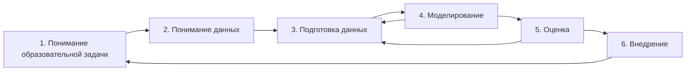

# Лекция 3. Методология CRISP-DM и интеллектуальный анализ образовательных данных

## Цель и планируемые результаты

### Цель

Освоить методологию CRISP-DM как каркас аналитического проекта и связать основные задачи Data Mining с типовыми образовательными задачами: классификацией риска, кластеризацией учебных траекторий и поиском ассоциативных правил.

### Планируемые результаты

После изучения мини-лекции студент способен:

- описывать фазы CRISP-DM;
- переводить педагогическую проблему в аналитическую постановку;
- выбирать задачу классификации, кластеризации или поиска ассоциаций;
- использовать метрики расстояния;
- интерпретировать Accuracy, Precision, Recall и F1;
- рассчитывать Support и Confidence;
- различать предсказательную и причинную интерпретацию;
- проектировать визуальное представление результатов для педагогической аудитории.

## Почему аналитический проект начинается не с модели

Типичная ошибка начинающего аналитика:

> «У меня есть таблица — применю Random Forest».

Правильная логика:

> «Какое образовательное решение необходимо поддержать и какие данные действительно позволяют это сделать?»

Именно поэтому удобна методология **CRISP-DM (Cross-Industry Standard Process for Data Mining)**.

## Фазы CRISP-DM

Классическая модель включает шесть взаимосвязанных фаз:

1. Business Understanding;
2. Data Understanding;
3. Data Preparation;
4. Modeling;
5. Evaluation;
6. Deployment.

В педагогическом контексте `Business Understanding` корректнее интерпретировать как **понимание образовательной задачи**.



CRISP-DM не является строго линейным процессом. После моделирования аналитик часто возвращается к подготовке данных, а после оценки — к исходной постановке задачи.

## Фаза 1. Понимание образовательной задачи

Исходная формулировка:

> «Хотим улучшить успеваемость».

слишком общая.

Аналитическая формулировка:

> «На основе данных первых четырех учебных недель определить обучающихся с повышенной вероятностью невыполнения итоговой работы, чтобы преподаватель мог предложить дополнительную поддержку».

Нужно определить:

- целевую группу;
- момент прогнозирования;
- целевую переменную;
- допустимые признаки;
- педагогическое действие;
- критерий успеха.

## Фаза 2. Понимание данных

На этапе EDA изучаются:

- распределения;
- пропуски;
- выбросы;
- баланс классов;
- зависимости;
- временная структура;
- качество идентификаторов.

Если из 1000 учеников только 50 относятся к группе риска:

$$
P(y=1)=\frac{50}{1000}=0.05.
$$

Модель, всегда отвечающая «риска нет», получит:

$$
Accuracy=0.95,
$$

но будет практически бесполезна для раннего предупреждения.

## Классификация образовательного риска

**Классификация** — задача присвоения объекту одной из заранее заданных категорий.

Примеры:

- риск / нет риска;
- сдал / не сдал;
- требуется помощь / не требуется;
- уровень текста A2 / B1 / B2.

### Матрица ошибок

|  | Фактически положительный | Фактически отрицательный |
|---|---:|---:|
| Предсказан положительный | TP | FP |
| Предсказан отрицательный | FN | TN |

### Accuracy

$$
Accuracy=\frac{TP+TN}{TP+TN+FP+FN}.
$$

### Precision

$$
Precision=\frac{TP}{TP+FP}.
$$

### Recall

$$
Recall=\frac{TP}{TP+FN}.
$$

### F1

$$
F_1=2\cdot\frac{Precision\cdot Recall}{Precision+Recall}.
$$

В Early Warning Systems часто особенно важен **Recall класса риска**, поскольку высокий $FN$ означает, что система пропускает ученика, которому действительно нужна поддержка.

Однако очень низкий Precision тоже проблематичен: преподаватель получит слишком много ложных предупреждений.

## Вероятность, порог и педагогическое решение

Классификатор часто выдает вероятность:

$$
P(y=1|x).
$$

Класс определяется порогом $\tau$:

$$
\hat{y}=
\begin{cases}
1, & P(y=1|x)\geq \tau,\\
0, & P(y=1|x)<\tau.
\end{cases}
$$

Изменение $\tau$ меняет соотношение Precision и Recall.

В образовательной аналитике порог нельзя выбирать только по технической метрике. Нужно учитывать стоимость ошибок. Пропустить ребенка с реальным риском обычно серьезнее, чем отправить ненавязчивое дополнительное напоминание ученику без риска.

## Explainable AI в раннем предупреждении

Современные исследования подчеркивают, что прогноз риска должен быть объяснимым.

Пример представления:

```text
Risk probability: 0.72

Основные факторы:
+ 4 пропущенных срока сдачи
+ снижение числа учебных сессий
+ низкий результат последней диагностики
- высокая активность на форуме
```

Но важно помнить:

$$
\text{predictive association} \neq \text{causation}.
$$

Если низкая активность в LMS связана с риском, нельзя автоматически утверждать, что именно она является причиной низкой успеваемости.

Современная Explainable Learning Analytics дополнительно рассматривает **дрейф данных**: факторы, хорошо объяснявшие результат в прошлом учебном году, могут изменить значение в новом контексте.

## Кластеризация учебных траекторий

**Кластеризация** — разбиение объектов на группы без заранее заданных классов.

Пример вектора ученика:

$$
x_i=(score_i,\ attempts_i,\ activity_i,\ delay_i).
$$

### Евклидово расстояние

$$
d_E(x,y)=\sqrt{\sum_{j=1}^{m}(x_j-y_j)^2}.
$$

Для двух признаков:

$$
d_E(x,y)=\sqrt{(x_1-y_1)^2+(x_2-y_2)^2}.
$$

### Манхэттенское расстояние

$$
d_M(x,y)=\sum_{j=1}^{m}|x_j-y_j|.
$$

### Расстояние Минковского

$$
d_p(x,y)=\left(\sum_{j=1}^{m}|x_j-y_j|^p\right)^{1/p}.
$$

При $p=1$ получаем Манхэттенское расстояние, при $p=2$ — Евклидово.

### Метод k-means

Задача k-means:

$$
\min_{C_1,\ldots,C_k}
\sum_{r=1}^{k}
\sum_{x_i\in C_r}
\|x_i-\mu_r\|^2,
$$

где $\mu_r$ — центроид кластера.

В образовательном анализе кластеры не следует автоматически называть «сильные» и «слабые». Более нейтральные названия:

- «высокая регулярность / средняя результативность»;
- «нерегулярная активность / высокий итоговый балл»;
- «много попыток / устойчивый прогресс».

## Ассоциативные правила

Ассоциативное правило:

$$
X \Rightarrow Y.
$$

Например:

```text
{регулярное выполнение, участие в форуме} => {успешная итоговая работа}
```

### Support

$$
Support(X\Rightarrow Y)=P(X\cap Y).
$$

В выборке:

$$
Support(X\Rightarrow Y)=\frac{N(X\cap Y)}{N}.
$$

### Confidence

$$
Confidence(X\Rightarrow Y)=P(Y|X)=\frac{Support(X\cap Y)}{Support(X)}.
$$

### Lift

$$
Lift(X\Rightarrow Y)=\frac{Confidence(X\Rightarrow Y)}{Support(Y)}.
$$

Если:

$$
Lift>1,
$$

совместное появление $X$ и $Y$ чаще ожидаемого при независимости.

Ассоциация не доказывает причинность.

## Data Storytelling

**Data Storytelling** — представление аналитического результата как связной аргументации, объединяющей данные, визуализацию и контекст.

Для школы удобна структура:

1. **Вопрос** — что хотим понять?
2. **Данные** — на чем основан вывод?
3. **Наблюдение** — что видно?
4. **Интерпретация** — что это может означать?
5. **Действие** — что сделать?
6. **Проверка** — изменился ли результат?


## Правила образовательной визуализации

Хорошая визуализация:

- отвечает на один основной вопрос;
- имеет понятную шкалу;
- не перегружена;
- показывает сравнение;
- не скрывает размер выборки;
- не создает ложного впечатления причинности.

Опасные приемы:

- обрезанная ось без явного обозначения;
- 3D-диаграммы без необходимости;
- слишком много цветов;
- круговые диаграммы с десятками категорий;
- выбор только удобного временного интервала;
- демонстрация среднего без разброса.

## Пример CRISP-DM для урока английского языка

### Задача

Определить учеников, которым может потребоваться помощь при работе с англоязычными текстами уровня B2.

### Данные

- результаты vocabulary quiz;
- среднее время чтения;
- число неизвестных слов;
- результат comprehension test;
- выполнение предыдущих заданий.

### Модель

$$
y=
\begin{cases}
1,& \text{нужна дополнительная поддержка},\\
0,& \text{поддержка по текущим данным не требуется}.
\end{cases}
$$

### Внедрение

Модель не назначает отметку. Она формирует сигнал учителю, который проверяет ситуацию и предлагает дифференцированный материал.

## Ключевые понятия

- CRISP-DM;
- classification;
- clustering;
- association rules;
- confusion matrix;
- Accuracy;
- Precision;
- Recall;
- F1;
- Euclidean distance;
- Manhattan distance;
- Minkowski distance;
- Support;
- Confidence;
- Lift;
- XAI;
- Data Storytelling.

## Дидактический практикум: как объяснить тему школьникам 10–11 классов

### Упражнение 1. Классификатор «нужна подсказка»

Дать школьникам 20 условных записей: результат теста, число попыток, срок сдачи и активность. Предложить простое правило:

```text
если score < 60 и attempts >= 3:
    support_needed = 1
```

Затем сравнить решение с фактической меткой и вручную заполнить TP, FP, FN, TN.

### Упражнение 2. Почему Accuracy обманывает

Предложить 100 учеников, среди которых 5 нуждаются в поддержке. Алгоритм всем ставит `0`.

$$
Accuracy=\frac{95}{100}=0.95.
$$

Но:

$$
Recall=0.
$$

Это наглядно показывает, почему нельзя оценивать модель одной метрикой.

### Упражнение 3. Кластеры без ярлыков

Ученикам дать точки `(время подготовки, балл)` и предложить визуально выделить группы. После этого обсудить, можно ли назвать кластер «ленивые», что мы реально знаем из данных и какие причины не представлены в таблице.

### Интеграция с английским языком

Использовать названия `consistent learners`, `late but successful`, `high effort / moderate score` и предложить школьникам объяснить кластер нейтральным английским описанием.

## Рекомендуемые источники

1. Susnjak T. *Beyond Predictive Learning Analytics Modelling and onto Explainable Artificial Intelligence with Prescriptive Analytics and ChatGPT*. International Journal of Artificial Intelligence in Education. 2024. Vol. 34. P. 452–482. DOI: https://doi.org/10.1007/s40593-023-00336-3
2. Tiukhova E. et al. *Explainable Learning Analytics: Assessing the stability of student success prediction models by means of explainable AI*. Decision Support Systems. 2024. Vol. 182. Article 114229. DOI: https://doi.org/10.1016/j.dss.2024.114229
3. Ouyang F., Zhang L. *AI-driven learning analytics applications and tools in computer-supported collaborative learning: A systematic review*. Educational Research Review. 2024. Vol. 44. Article 100616. DOI: https://doi.org/10.1016/j.edurev.2024.100616
4. Paolucci C. et al. *A review of learning analytics opportunities and challenges for K-12 education*. Heliyon. 2024. Vol. 10. Article e25767. DOI: https://doi.org/10.1016/j.heliyon.2024.e25767
5. Türkmen G. *The Review of Studies on Explainable Artificial Intelligence in Educational Research*. Journal of Educational Computing Research. 2025. DOI: https://doi.org/10.1177/07356331241310915

---
