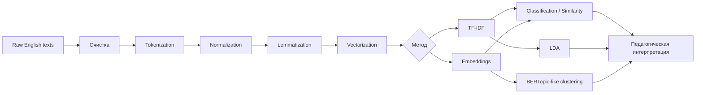
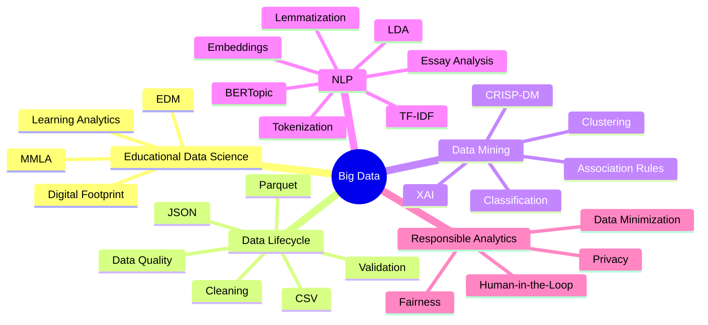

# Лекция 4. Прикладное машинное обучение и NLP для лингводидактики

## Цель и планируемые результаты

### Цель

Сформировать базовое понимание машинного обучения и современных методов NLP применительно к анализу англоязычных образовательных материалов, письменных работ и учебных корпусов.

### Планируемые результаты

После изучения мини-лекции студент способен:

- различать обучение с учителем и без учителя;
- выбирать базовый ML-алгоритм для образовательной задачи;
- строить логическую последовательность NLP-конвейера;
- объяснять токенизацию и лемматизацию;
- вычислять и интерпретировать TF-IDF;
- объяснять различие TF-IDF и контекстных эмбеддингов;
- описывать идею LDA;
- сравнивать LDA и BERTopic на концептуальном уровне;
- критически оценивать использование Automated Essay Scoring;
- использовать NLP как инструмент поддержки учителя английского языка.

## Что такое машинное обучение

**Машинное обучение (Machine Learning, ML)** — класс методов, позволяющих строить алгоритмическую модель зависимости на основе данных.

В упрощенном виде:

$$
\hat{y}=f(x;\theta),
$$

где $x$ — признаки, $\theta$ — параметры модели, $\hat{y}$ — прогноз.

В обучении с учителем параметры выбираются так, чтобы минимизировать функцию потерь:

$$
\theta^*=\arg\min_{\theta}
\frac{1}{N}
\sum_{i=1}^{N}
L(y_i,f(x_i;\theta)).
$$

## Основные типы задач ML

### Обучение с учителем

Имеется целевая переменная $y$.

Примеры:

- прогноз результата;
- классификация уровня текста;
- определение риска;
- автоматическая предварительная оценка письменной работы.

Базовые алгоритмы:

- Logistic Regression;
- Decision Tree;
- Random Forest;
- Gradient Boosting;
- k-NN;
- SVM.

### Обучение без учителя

Готовой целевой метки нет.

Примеры:

- кластеризация учеников;
- группировка текстов;
- тематическое моделирование.

Алгоритмы:

- k-means;
- hierarchical clustering;
- DBSCAN/HDBSCAN;
- LDA;
- BERTopic-подобные подходы.

## ML не заменяет педагогическую постановку

Высокое качество модели не означает автоматически полезный педагогический результат.

Перед обучением необходимо определить:

- что является объектом анализа;
- что означает целевая метка;
- в какой момент доступен прогноз;
- какое действие последует после прогноза;
- насколько допустимы ошибки разных типов.

Особенно важен принцип **Human-in-the-Loop**:


## NLP в обучении английскому языку

**Natural Language Processing (NLP)** — методы компьютерной обработки естественного языка.

Образовательные применения:

- анализ сложности текста;
- подбор материалов;
- проверка словарного состава;
- анализ эссе;
- тематическое моделирование;
- классификация вопросов;
- анализ обратной связи;
- поиск характерных ошибок;
- сравнение ученических корпусов.

## Корпус и единица анализа

**Корпус** — систематизированная коллекция текстов.

Для лингводидактики корпус может включать:

- эссе учеников;
- учебные тексты;
- статьи;
- ответы на открытые вопросы;
- транскрипты;
- отзывы.

Важно определить единицу анализа: документ, абзац, предложение или токен.

## NLP-конвейер



Предобработка должна соответствовать задаче. Например, при анализе авторского стиля удаление всех служебных слов может уничтожить полезную информацию.

## Токенизация

**Токенизация** — разбиение текста на единицы.

Исходный текст:

```text
Students aren't always learning in the same way.
```

Возможная токенизация:

```text
Students
are
n't
always
learning
in
the
same
way
.
```

Разные токенизаторы могут обрабатывать сокращения и пунктуацию по-разному.

## Стемминг и лемматизация

### Стемминг

Грубое отсечение аффиксов:

```text
studies -> studi
studying -> studi
```

Полученный stem не обязан быть словарным словом.

### Лемматизация

Приведение к словарной форме:

```text
studies -> study
studying -> study
went -> go
better -> good
```

Для лингводидактики лемматизация часто предпочтительнее, потому что результат проще интерпретировать.

## Bag of Words

Пусть словарь:

```text
["data", "learn", "student"]
```

Документ:

```text
"student learn data data"
```

Вектор частот:

$$
x=(2,1,1),
$$

если порядок словаря `data`, `learn`, `student`.

Недостаток: теряется контекст и порядок слов.

## TF-IDF

TF-IDF повышает вес слов, характерных для документа, и снижает вес слов, встречающихся во многих документах.

### Term Frequency

$$
TF(t,d)=\frac{f_{t,d}}{\sum_k f_{k,d}},
$$

где $f_{t,d}$ — число вхождений терма $t$ в документ $d$.

### Inverse Document Frequency

Один из распространенных вариантов:

$$
IDF(t)=\ln\left(\frac{N}{df(t)}\right),
$$

где $N$ — число документов, $df(t)$ — число документов, содержащих $t$.

### TF-IDF

$$
TFIDF(t,d)=TF(t,d)\cdot IDF(t).
$$

На практике библиотеки могут использовать сглаживание и немного отличающиеся варианты формулы.

В корпусе школьных эссе слово `the` встречается почти везде и получает невысокий IDF. Слово `photosynthesis` может встречаться только в части текстов и получить больший вес.

## Косинусное сходство

Для текстовых векторов часто используется:

$$
\cos(\theta)=\frac{x\cdot y}{\|x\|\|y\|}.
$$

Если значение близко к 1, направления векторов похожи.

Это позволяет:

- искать похожие тексты;
- сравнивать ответы;
- строить информационный поиск;
- находить близкие учебные материалы.


## Readability: оценка сложности англоязычного текста

Классические показатели **readability** учитывают длину предложения, длину слова и число слогов.

Например, показатель **Flesch Reading Ease (FRE)** для английского языка вычисляется по формуле:

$$
FRE = 206.835 - 1.015\left(\frac{W}{S}\right) - 84.6\left(\frac{SY}{W}\right)
$$

где:

- $W$ — число слов в тексте;
- $S$ — число предложений;
- $SY$ — число слогов.

Чем выше значение $FRE$, тем легче текст для чтения. Более низкие значения, напротив, соответствуют более сложным текстам.

Важно учитывать, что **Flesch Reading Ease** является формальной метрикой читаемости и не определяет непосредственно уровень владения английским языком по шкале CEFR. Современные методы оценки сложности текста дополнительно учитывают лексическую частотность, синтаксическую сложность, разнообразие словаря, связность текста и семантические признаки.

Такие формулы удобны как базовая модель, но современная автоматическая оценка читаемости учитывает более широкий набор признаков:

- лексическую частотность;
- синтаксическую сложность;
- разнообразие лексики;
- связность;
- семантические характеристики;
- контекстные embeddings.

Для будущего учителя английского языка важно понимать: **readability score не равен автоматически уровню CEFR**.

## Embeddings

В TF-IDF слова представлены через частоты. В embeddings текст отображается в плотный числовой вектор:

$$
text \rightarrow \mathbf{v}\in\mathbb{R}^{d}.
$$

Контекстные embeddings позволяют отражать семантическую близость. Например, `teacher`, `instructor`, `educator` могут иметь близкие векторы, несмотря на различие токенов.

Это важно для:

- семантического поиска;
- кластеризации;
- классификации;
- современных topic models.

## Тематическое моделирование LDA

**Latent Dirichlet Allocation (LDA)** — вероятностная модель, в которой документ рассматривается как смесь тем, а каждая тема — как распределение вероятностей по словам.

Идея:

$$
P(w|d)=\sum_{k=1}^{K}P(w|z=k)P(z=k|d),
$$

где $d$ — документ, $w$ — слово, $z$ — скрытая тема, $K$ — число тем.

Например, эссе может быть представлено:

```text
Topic 1 "technology": 0.55
Topic 2 "education": 0.35
Topic 3 "environment": 0.10
```

А тема `education`:

```text
student: 0.12
school: 0.10
teacher: 0.08
learning: 0.07
...
```

### Педагогические применения

- анализ тем школьных эссе;
- сравнение тематического содержания групп;
- анализ отзывов;
- тематизация форумов;
- исследование учебного корпуса.

## Ограничения LDA

LDA основана на модели «мешка слов», поэтому ограниченно учитывает порядок, контекст, полисемию и семантическую близость разных слов.

Поэтому в современной практике LDA полезно изучать как фундаментальный вероятностный подход и сравнивать с embedding-based методами.

## BERTopic как современное развитие тематического анализа

BERTopic-подобный конвейер строится вокруг:

1. контекстных embeddings;
2. снижения размерности;
3. кластеризации;
4. формирования интерпретируемых тематических слов.


Главное концептуальное отличие:

- LDA строит вероятностную генеративную модель «документ — тема — слово»;
- BERTopic использует семантические представления документов и кластеризацию.

Один метод не всегда превосходит другой. Выбор зависит от размера корпуса, длины документов, языка, необходимости интерпретации, вычислительных ресурсов и исследовательской задачи.

## Automated Essay Scoring

**Automated Essay Scoring (AES)** — автоматическое получение оценки или набора показателей для письменного текста.

Признаки могут включать:

- длину текста;
- синтаксические показатели;
- лексическое разнообразие;
- связность;
- TF-IDF;
- embeddings;
- признаки ошибок;
- нейросетевые представления.

Современная литература подчеркивает проблемы переносимости между темами, устойчивости к необычным ответам, справедливости, интерпретируемости и соответствия реальным сценариям обучения.

Для педагогического курса безопаснее использовать AES как **инструмент предварительной аналитики или поддержки обратной связи**, а не как автономного «электронного экзаменатора».

## Пример гибридной оценки письменной работы

Вместо единственной автоматической отметки можно рассчитывать профиль:

$$
Profile=(vocabulary,\ syntax,\ coherence,\ topic,\ mechanics).
$$

Например:

| Показатель | Значение |
|---|---:|
| Lexical diversity | 0.71 |
| Sentence complexity | 0.64 |
| Topic relevance | 0.82 |
| Cohesion proxy | 0.68 |

Преподаватель получает дополнительные сигналы, но сохраняет ответственность за содержательное оценивание.

## Алгоритмическая предвзятость в NLP

Модель может работать неодинаково для носителей и изучающих язык, разных уровней владения английским, разных жанров, коротких и длинных текстов, а также вариантов английского языка.

Поэтому рекомендуется оценивать метрики не только в среднем:

$$
F1_{\text{overall}},
$$

но и по педагогически значимым подгруппам:

$$
F1_{A2},\quad F1_{B1},\quad F1_{B2}.
$$

Существенное различие требует анализа причин.

## Ключевые понятия

- supervised learning;
- unsupervised learning;
- NLP;
- corpus;
- tokenization;
- stemming;
- lemmatization;
- Bag of Words;
- TF-IDF;
- cosine similarity;
- readability;
- embeddings;
- LDA;
- BERTopic;
- Automated Essay Scoring;
- Human-in-the-Loop.

## Дидактический практикум: как объяснить тему школьникам 10–11 классов

### Упражнение 1. «Какие слова важны?»

Взять три коротких текста:

```text
Text A: Students learn programming and algorithms.
Text B: Students learn English vocabulary and grammar.
Text C: Programming students solve algorithmic problems.
```

Попросить учащихся:

1. выписать частоты;
2. определить слова, встречающиеся почти во всех текстах;
3. предположить, какие слова TF-IDF сделает более значимыми.

### Упражнение 2. Лемма

Сравнить:

```text
learn
learns
learned
learning
```

Показать, почему для частотного анализа полезно свести формы к `learn`.

### Упражнение 3. Topic Modeling без формальной математики

Дать 15 коротких английских предложений по темам `school`, `environment`, `technology`, убрать названия тем и предложить школьникам вручную сгруппировать документы.

После этого объяснить:

> Topic Modeling решает похожую задачу автоматически на большом корпусе.

### Упражнение 4. Почему автоматическая оценка эссе не должна быть единственным судьей

Показать два текста:

- грамматически правильный, но бессодержательный;
- содержательный, но с несколькими языковыми ошибками.

Обсудить, может ли единственная метрика корректно определить качество.

### Интеграция предметов

**Информатика:** векторизация, расстояния, алгоритмы классификации.  
**Английский язык:** лексика, морфология, сложность текста, тематическая структура.

Такой формат показывает школьникам, что NLP — практическая точка пересечения программирования, математики и лингвистики.

## Рекомендуемые источники

1. Li S., Ng V. *Automated Essay Scoring: A Reflection on the State of the Art*. Proceedings of EMNLP 2024. P. 17876–17888. DOI: https://doi.org/10.18653/v1/2024.emnlp-main.991
2. *A Systematic Literature Review: Are Automated Essay Scoring Systems Competent in Real-Life Education Scenarios?* IEEE Access. 2024. Vol. 12. P. 77639–77657. DOI: https://doi.org/10.1109/ACCESS.2024.3399163
3. Crossley S. A. *Developing Linguistic Constructs of Text Readability Using Natural Language Processing*. Scientific Studies of Reading. Published online 2024. DOI: https://doi.org/10.1080/10888438.2024.2422365
4. Blei D. M., Ng A. Y., Jordan M. I. *Latent Dirichlet Allocation*. Journal of Machine Learning Research. 2003. Vol. 3. P. 993–1022. URL: https://www.jmlr.org/papers/v3/blei03a.html
5. Grootendorst M. *BERTopic: Neural topic modeling with a class-based TF-IDF procedure*. 2022. DOI: https://doi.org/10.48550/arXiv.2203.05794
6. Khodeir N., Elghannam F. *Efficient topic identification for urgent MOOC Forum posts using BERTopic and traditional topic modeling techniques*. Education and Information Technologies. 2025. Vol. 30. P. 5501–5527. DOI: https://doi.org/10.1007/s10639-024-13003-4

---

# Итоговая концептуальная карта курса

## Концептуальная карта дисциплины «Методы анализа больших данных»


## Концептуальная карта дисциплины «Методы анализа больших данных»


---

# Общие выводы

1. **Большие данные в образовании — это не только объем.** Ключевое значение имеют разнообразие, скорость, достоверность и педагогическая ценность данных.
2. **EDM и Learning Analytics следует изучать совместно.** Алгоритмическая модель становится образовательным инструментом только после интерпретации и включения результата в педагогический цикл.
3. **Качество модели начинается с качества данных.** Верификация, борьба с утечкой данных и воспроизводимость предобработки являются обязательной частью аналитического проекта.
4. **Accuracy не является универсальной метрикой.** В задачах раннего выявления риска необходимо анализировать Precision, Recall, F1 и характер ошибок.
5. **Классические методы NLP остаются фундаментом.** TF-IDF и LDA позволяют понять математическую основу представления текста, после чего логично переходить к embeddings и BERTopic.
6. **Прогноз не является диагнозом.** Любой сигнал модели должен рассматриваться как основание для педагогической проверки, а не как автоматическое решение о способностях ученика.
7. **Этика должна быть встроена в архитектуру.** Минимизация данных, разграничение доступа, прозрачность, контроль предвзятости и участие человека являются частью методологии анализа, а не дополнительным этапом после создания модели.

---

# Сводный список научных и нормативных источников

1. Cerezo R., Lara J.-A., Azevedo R., Romero C. Reviewing the differences between learning analytics and educational data mining: Towards educational data science // *Computers in Human Behavior*. 2024. Vol. 154. 108155. DOI: https://doi.org/10.1016/j.chb.2024.108155
2. Sailer M., Ninaus M., Huber S. E. et al. The End is the Beginning is the End: The closed-loop learning analytics framework // *Computers in Human Behavior*. 2024. Vol. 158. 108305. DOI: https://doi.org/10.1016/j.chb.2024.108305
3. Ouhaichi H., Spikol D., Vogel B. Research trends in multimodal learning analytics: A systematic mapping study // *Computers and Education: Artificial Intelligence*. 2023. Vol. 4. 100136. DOI: https://doi.org/10.1016/j.caeai.2023.100136
4. Prinsloo P., Slade S., Khalil M. Multimodal learning analytics—In-between student privacy and encroachment: A systematic review // *British Journal of Educational Technology*. 2023. Vol. 54, No. 6. P. 1566–1586. DOI: https://doi.org/10.1111/bjet.13373
5. Giannakos M., Cukurova M. The role of learning theory in multimodal learning analytics // *British Journal of Educational Technology*. 2023. Vol. 54. DOI: https://doi.org/10.1111/bjet.13320
6. Ouyang F., Zhang L. AI-driven learning analytics applications and tools in computer-supported collaborative learning: A systematic review // *Educational Research Review*. 2024. Vol. 44. 100616. DOI: https://doi.org/10.1016/j.edurev.2024.100616
7. Paulsen L., Lindsay E. Learning analytics dashboards are increasingly becoming about learning and not just analytics — A systematic review // *Education and Information Technologies*. 2024. Vol. 29. P. 14279–14308. DOI: https://doi.org/10.1007/s10639-023-12401-4
8. Paolucci C., Vancini S., Bex R. T. II, Cavanaugh C. A review of learning analytics opportunities and challenges for K-12 education // *Heliyon*. 2024. Vol. 10. e25767. DOI: https://doi.org/10.1016/j.heliyon.2024.e25767
9. Susnjak T. Beyond Predictive Learning Analytics Modelling and onto Explainable Artificial Intelligence with Prescriptive Analytics and ChatGPT // *International Journal of Artificial Intelligence in Education*. 2024. Vol. 34. P. 452–482. DOI: https://doi.org/10.1007/s40593-023-00336-3
10. Tiukhova E. et al. Explainable Learning Analytics: Assessing the stability of student success prediction models by means of explainable AI // *Decision Support Systems*. 2024. Vol. 182. 114229. DOI: https://doi.org/10.1016/j.dss.2024.114229
11. Li S., Ng V. Automated Essay Scoring: A Reflection on the State of the Art // *Proceedings of EMNLP 2024*. P. 17876–17888. DOI: https://doi.org/10.18653/v1/2024.emnlp-main.991
12. A Systematic Literature Review: Are Automated Essay Scoring Systems Competent in Real-Life Education Scenarios? // *IEEE Access*. 2024. Vol. 12. P. 77639–77657. DOI: https://doi.org/10.1109/ACCESS.2024.3399163
13. Crossley S. A. Developing Linguistic Constructs of Text Readability Using Natural Language Processing // *Scientific Studies of Reading*. Published online 2024. DOI: https://doi.org/10.1080/10888438.2024.2422365
14. Grootendorst M. BERTopic: Neural topic modeling with a class-based TF-IDF procedure. 2022. DOI: https://doi.org/10.48550/arXiv.2203.05794
15. Blei D. M., Ng A. Y., Jordan M. I. Latent Dirichlet Allocation // *Journal of Machine Learning Research*. 2003. Vol. 3. P. 993–1022. URL: https://www.jmlr.org/papers/v3/blei03a.html
16. Khodeir N., Elghannam F. Efficient topic identification for urgent MOOC Forum posts using BERTopic and traditional topic modeling techniques // *Education and Information Technologies*. 2025. Vol. 30. P. 5501–5527. DOI: https://doi.org/10.1007/s10639-024-13003-4
17. Огоев А. У., Хаблиева С. Р. Анализ цифрового следа как средство повышения качества подготовки студентов // *Азимут научных исследований: педагогика и психология*. 2023. Т. 12. № 4(45). URL: https://cyberleninka.ru/article/n/analiz-tsifrovogo-sleda-kak-sredstvo-povysheniya-kachestva-podgotovki-studentov
18. Федеральный закон от 27.07.2006 № 152-ФЗ «О персональных данных». Официальный интернет-портал правовой информации. URL: https://pravo.gov.ru/
19. European Commission. Data protection and safeguards for children's personal data under the GDPR. URL: https://commission.europa.eu/law/law-topic/data-protection/
20. U.S. Federal Trade Commission. Children's Online Privacy Protection Rule (COPPA), including 2025 amendments. URL: https://www.ftc.gov/legal-library/browse/rules/childrens-online-privacy-protection-rule-coppa
21. Правительство Москвы. Материалы о проекте «Московская электронная школа»: электронный журнал и дневник, библиотека образовательных материалов, цифровое портфолио. URL: https://www.mos.ru/
22. *A Survey of Multimodal Learning Analytics: Data, Methods, Systems, and Responsible Deployment* // Future Internet. 2026. Vol. 18, No. 3. Article 115. URL: https://www.mdpi.com/1999-5903/18/3/115
23. Jimenez Martinez A. L., Sood K., Mahto R. *Early Detection of At-Risk Students Using Machine Learning*. 2024. URL: https://arxiv.org/abs/2412.09483

---

> **Методическое замечание.** Представленные модели архитектуры LMS/МЭШ являются учебными логическими схемами потоков данных. Они не претендуют на описание закрытой внутренней программно-технической архитектуры конкретной государственной информационной системы.
