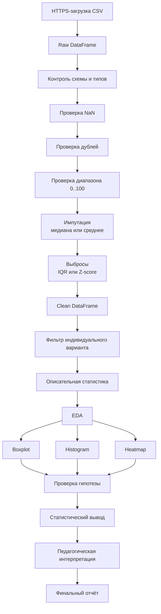
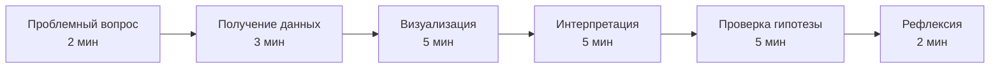

# Лабораторная работа № 1. Предобработка и разведочный анализ образовательных данных

**Дисциплина:** «К.М.06.04 Методы анализа больших данных»  
**Профиль:** «Информатика и английский язык»  
**Формат выполнения:** Google Colab, Python 3.10+  
**Исходный датасет:** `StudentsPerformance.csv`

> **Техническое примечание.** В коде первым используется URL, заданный в условии:
>
> `https://raw.githubusercontent.com/sriharikadali/Students-Performance-in-Exams/master/StudentsPerformance.csv`
>
> Для устойчивого запуска предусмотрен резервный прямой URL на идентичный открытый файл:
>
> `https://raw.githubusercontent.com/NadavKiani/Students-Performance-in-Exams/master/StudentsPerformance.csv`
>
> Резерв используется только при сетевой или HTTP-ошибке основного адреса.

---

## Паспорт работы

| Параметр | Содержание |
|---|---|
| Название | **Комплексная лабораторная работа № 1. Предобработка и разведочный анализ образовательных данных** |
| Трудоёмкость | **8 академических часов** |
| Формируемая компетенция | **ПК-1.2** — применение цифровых технологий и методов обработки и анализа данных для решения профессиональных и учебно-методических задач |
| Формат | Индивидуальная работа по варианту, Google Colab |
| Итог | Notebook, статистический отчёт, визуализации, проверка гипотезы, методическая разработка |

### Цель

Освоить воспроизводимый конвейер первичного анализа образовательных данных: от программного получения CSV по HTTPS и контроля качества до очистки, EDA, визуализации, проверки исследовательской гипотезы и педагогической интерпретации.

### Задачи

1. Загрузить набор по прямой HTTPS-ссылке без ручной загрузки файла.
2. Исследовать структуру и типы признаков.
3. Проверить пропуски, дубли, диапазоны и выбросы.
4. Применить метод очистки своего варианта.
5. Выполнить индивидуальную фильтрацию.
6. Рассчитать описательные статистики.
7. Построить boxplot, histogram и correlation heatmap.
8. Проверить исследовательскую гипотезу.
9. Сформулировать статистически корректный вывод без подмены связи причинностью.
10. Разработать фрагмент урока анализа данных для 10–11 классов.

### Планируемые результаты

Студент способен:

- организовывать программное получение и верификацию образовательных данных;
- применять IQR и Z-score для поиска потенциальных выбросов;
- применять среднее и медиану для импутации числовых пропусков;
- выполнять фильтрацию, группировку и статистическое описание;
- визуализировать распределения и корреляции;
- формулировать и проверять гипотезу;
- переводить результаты анализа в школьное дидактическое задание.

---

## Структура исходного датасета

| Поле | Тип | Содержание |
|---|---|---|
| `gender` | категориальный | категория пола в исходном наборе |
| `race/ethnicity` | категориальный | группа, заданная авторами исходного набора |
| `parental level of education` | категориальный | уровень образования родителей |
| `lunch` | категориальный | `standard` / `free/reduced` |
| `test preparation course` | категориальный | `completed` / `none` |
| `math score` | числовой | результат по математике |
| `reading score` | числовой | результат по чтению |
| `writing score` | числовой | результат по письму |

> Социально-демографические категории в лабораторной используются только для обучения фильтрации и статистической интерпретации. Они не являются основанием для выводов о способностях конкретного учащегося.

---

## Архитектура конвейера предобработки и EDA



Воспроизводимый процесс:

$$
D_{raw} \rightarrow D_{validated} \rightarrow D_{clean} \rightarrow D_{variant} \rightarrow Report.
$$

---

## Теоретический минимум

### Z-оценка и правило $3\sigma$

$$
z = \frac{x - \mu}{\sigma}.
$$

Потенциальный выброс:

$$
|z|>3.
$$

Здесь $\mu$ — среднее, $\sigma$ — стандартное отклонение.

### Межквартильный размах

$$
IQR=Q_3-Q_1.
$$

Нижняя и верхняя границы:

$$
L=Q_1-1.5\cdot IQR,
$$

$$
U=Q_3+1.5\cdot IQR.
$$

Интервал:

$$
[Q_1-1.5\cdot IQR,\ Q_3+1.5\cdot IQR].
$$

### Min-Max нормализация

$$
x_{norm}=\frac{x-x_{min}}{x_{max}-x_{min}}.
$$

Обычно:

$$
0\leq x_{norm}\leq1.
$$

### Доля пропусков

$$
r_{miss}=\frac{N_{miss}}{N}.
$$

Полнота:

$$
Completeness=1-r_{miss}.
$$

### Среднее и медиана

$$
\bar{x}=\frac{1}{n}\sum_{i=1}^n x_i.
$$

Медиана устойчивее среднего к экстремальным значениям, поэтому выбор метода импутации должен учитывать форму распределения.

---

## Общий алгоритм выполнения работы

1. Создать Google Colab Notebook; указать ФИО, группу, вариант и гипотезу.
2. Импортировать `numpy`, `pandas`, `matplotlib`, `seaborn`, `scipy`.
3. Загрузить CSV программно по HTTPS.
4. Выполнить `head()`, `shape`, `info()`, `isna().sum()`, `duplicated().sum()`, `describe()`.
5. Проверить, что баллы находятся в диапазоне $0\leq score\leq100$.
6. Реализовать заданную импутацию пропусков. Если пропусков нет, зафиксировать это, но код обработки всё равно оставить.
7. Найти потенциальные выбросы строго методом своего варианта.
8. Сформировать отдельный `df_clean`, сохранив `df_raw`.
9. Применить фильтр варианта.
10. Рассчитать `count`, `mean`, `median`, `std`, `min`, `max`, $Q_1$, $Q_3$, $IQR$.
11. Построить не менее трёх обязательных визуализаций: boxplot, histogram, heatmap.
12. Сформулировать $H_0$, $H_1$, выбрать критерий и уровень $\alpha=0.05$.
13. Рассчитать $p$-value и сформулировать содержательный вывод.
14. Разработать школьный микроурок.
15. Сдать воспроизводимый `.ipynb` или ссылку на Colab.

---

## 6. Варианты заданий

| № варианта | Исследуемая целевая группа / фильтр | Метрики успеваемости | Метод обработки выбросов и пропусков | Специфическая гипотеза | Тема школьного микроурока |
|---:|---|---|---|---|---|
| 1 | `gender == 'female'` | Reading, Writing | IQR; медиана | **EN:** Female students who completed test preparation have higher mean writing scores than those who did not. **RU:** Среди девушек прошедшие подготовительный курс имеют более высокий средний балл по письму. | «Выбросы в данных»: boxplot и квартильный размах. |
| 2 | `gender == 'male'` | Math, Reading | Z-score; среднее | **EN:** Male students who completed test preparation have higher mean math scores than those who did not. **RU:** Среди юношей прошедшие подготовительный курс имеют более высокий средний балл по математике. | «Среднее и стандартное отклонение». |
| 3 | `race/ethnicity == 'group A'` | Math, Reading, Writing | IQR; медиана | **EN:** Within group A, reading and writing scores are positively associated. **RU:** В группе A баллы по чтению и письму положительно связаны. | «Корреляция не означает причинность». |
| 4 | `race/ethnicity == 'group B'` | Math, Writing | Z-score; среднее | **EN:** In group B, students with standard lunch have higher mean math scores than students with free/reduced lunch. **RU:** В группе B учащиеся со standard lunch имеют более высокий средний балл по математике. | «Сравнение двух групп» и корректная диаграмма. |
| 5 | `race/ethnicity == 'group C'` | Reading, Writing | IQR; медиана | **EN:** In group C, completed test preparation is associated with higher writing scores. **RU:** В группе C завершение подготовительного курса связано с более высокими баллами по письму. | «Гипотеза и данные». |
| 6 | `race/ethnicity == 'group D'` | Math, Reading, Writing | Z-score; среднее | **EN:** In group D, the mean reading score is higher than the mean math score. **RU:** В группе D средний балл по чтению выше среднего балла по математике. | «Парные показатели». |
| 7 | `race/ethnicity == 'group E'` | Math, Reading | IQR; медиана | **EN:** In group E, math and reading scores show a positive correlation. **RU:** В группе E баллы по математике и чтению положительно коррелируют. | «Диаграмма рассеяния». |
| 8 | `lunch == 'standard'` | Math, Reading, Writing | Z-score; среднее | **EN:** Among students with standard lunch, completed test preparation is associated with a higher overall mean score. **RU:** Среди учащихся со standard lunch подготовительный курс связан с более высоким средним общим результатом. | «Сводный показатель успеваемости». |
| 9 | `lunch == 'free/reduced'` | Math, Reading, Writing | IQR; медиана | **EN:** Among students with free/reduced lunch, completed test preparation is associated with higher reading scores. **RU:** Среди учащихся с free/reduced lunch подготовительный курс связан с более высокими баллами по чтению. | «Данные и социальный контекст». |
| 10 | `test preparation course == 'completed'` | Math, Reading, Writing | Z-score; среднее | **EN:** Among students who completed test preparation, reading and writing scores have a strong positive correlation. **RU:** Среди прошедших подготовительный курс баллы по чтению и письму имеют сильную положительную связь. | «Корреляционная матрица». |
| 11 | `test preparation course == 'none'` | Math, Reading, Writing | IQR; медиана | **EN:** Among students without test preparation, writing scores differ between female and male students. **RU:** Среди не проходивших подготовку баллы по письму различаются у девушек и юношей. | «Категориальные признаки и группировка». |
| 12 | `parental level of education == 'high school'` | Math, Reading | Z-score; среднее | **EN:** For this subgroup, standard lunch is associated with higher math scores. **RU:** Для этой подгруппы standard lunch связан с более высокими баллами по математике. | «Фильтрация по одному условию». |
| 13 | `parental level of education == 'some high school'` | Reading, Writing | IQR; медиана | **EN:** In this subgroup, reading and writing scores are positively associated. **RU:** В данной подгруппе баллы по чтению и письму положительно связаны. | «Линейная связь и scatterplot». |
| 14 | `parental level of education == 'some college'` | Math, Reading, Writing | Z-score; среднее | **EN:** Students who completed test preparation have a higher mean overall score. **RU:** Учащиеся, завершившие подготовительный курс, имеют более высокий средний общий балл. | «Среднее арифметическое как агрегат». |
| 15 | `parental level of education == "associate's degree"` | Math, Writing | IQR; медиана | **EN:** In this subgroup, completed test preparation is associated with higher writing scores. **RU:** В этой подгруппе подготовительный курс связан с более высокими баллами по письму. | «Boxplot: медиана, квартили, выброс». |
| 16 | `parental level of education == "bachelor's degree"` | Reading, Writing | Z-score; среднее | **EN:** Reading score is positively associated with writing score in this subgroup. **RU:** В данной подгруппе балл по чтению положительно связан с баллом по письму. | «Тепловая карта корреляций». |
| 17 | `parental level of education == "master's degree"` | Math, Reading, Writing | IQR; медиана | **EN:** The median overall score of students who completed test preparation is higher than that of students who did not. **RU:** Медианный общий балл прошедших подготовку выше, чем у не проходивших её. | «Среднее или медиана?». |
| 18 | `gender == 'female' and lunch == 'standard'` | Math, Reading, Writing | Z-score; среднее | **EN:** Completed test preparation is associated with a higher overall score. **RU:** В этой подгруппе прохождение подготовки связано с более высоким общим баллом. | «Составной фильтр AND». |
| 19 | `gender == 'male' and lunch == 'standard'` | Math, Reading, Writing | IQR; медиана | **EN:** Math and reading scores are positively correlated. **RU:** В этой подгруппе баллы по математике и чтению положительно коррелируют. | «Корреляция двух школьных результатов». |
| 20 | `gender == 'female' and lunch == 'free/reduced'` | Reading, Writing | Z-score; среднее | **EN:** Completed test preparation is associated with higher reading scores. **RU:** В этой подгруппе подготовительный курс связан с более высокими баллами по чтению. | «Наблюдение и причинный вывод». |
| 21 | `gender == 'male' and lunch == 'free/reduced'` | Math, Writing | IQR; медиана | **EN:** Completed test preparation is associated with higher writing scores. **RU:** В этой подгруппе подготовительный курс связан с более высокими баллами по письму. | «H0 и H1 для школьников». |
| 22 | `test preparation course == 'completed' and lunch == 'standard'` | Math, Reading, Writing | Z-score; среднее | **EN:** Reading score is on average higher than math score. **RU:** В этой подгруппе средний балл по чтению выше среднего балла по математике. | «Парные данные». |
| 23 | `test preparation course == 'none' and lunch == 'standard'` | Math, Reading, Writing | IQR; медиана | **EN:** Reading-writing correlation is stronger than math-writing correlation. **RU:** Связь чтения и письма сильнее, чем связь математики и письма. | «Сравнение коэффициентов корреляции». |
| 24 | `parental level of education` — `some college` и выше | Math, Reading, Writing | Z-score; среднее | **EN:** Completed test preparation is associated with a higher overall score. **RU:** В отфильтрованной группе подготовительный курс связан с более высоким общим баллом. | «Фильтрация по множеству значений». |
| 25 | `lunch == 'standard'`; сравнить `test preparation course` | Math, Reading, Writing; основная — Writing | IQR; медиана | **EN:** Among students with standard lunch, students who completed the test preparation course have a higher mean writing score than students who did not. **RU:** Среди учащихся со standard lunch прошедшие подготовительный курс имеют более высокий средний балл по письму, чем не проходившие его. | Интегрированный микроурок «EDA успеваемости: boxplot, histogram, heatmap». |

---

## 7. ПРИМЕРНОЕ условие варианта № 25

### Целевая группа

```python
lunch == "standard"
```

Внутри неё сравнить:

```python
test preparation course == "completed"
```

и

```python
test preparation course == "none"
```

### Метрики

- `math score`;
- `reading score`;
- `writing score`.

Основная проверяемая метрика — `writing score`.

### Очистка

- числовые пропуски — **медиана**;
- категориальные пропуски — **мода**;
- потенциальные выбросы — **IQR** по трём экзаменационным баллам.

### Гипотеза

**EN:** Among students with standard lunch, students who completed the test preparation course have a higher mean writing score than students who did not.

**RU:** Среди учащихся со `standard` lunch прошедшие подготовительный курс имеют более высокий средний балл по письму, чем не проходившие его.

$$
H_0:\ \mu_{completed}\leq\mu_{none},
$$

$$
H_1:\ \mu_{completed}>\mu_{none}.
$$

Рекомендуемый критерий — односторонний Welch t-test.

$$
\alpha=0.05.
$$

---

## Требования к визуализации

Обязательны:

1. **Boxplot** — `writing score` по `test preparation course`.
2. **Histplot** — распределение `writing score` по группам.
3. **Heatmap** — корреляции `math score`, `reading score`, `writing score`.

Заголовки — двуязычные, например:

```text
Writing score by test preparation / Баллы за письмо по подготовке к тесту
```

Каждый график должен иметь заголовок, подписи осей и, при необходимости, легенду.

---

## Методический блок для учителя

### Шаблон технологической карты фрагмента урока

| Элемент | Содержание |
|---|---|
| Тема | «Как данные помогают проверять учебные гипотезы» или тема своего варианта |
| Класс | 10–11 |
| Продолжительность | 15–25 минут |
| Тип занятия | Информатика / интегрированное «Информатика + английский язык» |
| Цель | Действие с данными, которое должен освоить школьник |
| Предметный результат | Например, построить и интерпретировать boxplot |
| Метапредметный результат | Аргументировать вывод данными |
| Англоязычная составляющая | `mean`, `median`, `outlier`, `distribution`, `hypothesis`, `evidence` |
| Исходные данные | Обезличенный фрагмент `StudentsPerformance.csv` |
| Проблемный вопрос | Что можно утверждать по графику, а что нельзя? |
| Действия учителя | Постановка задачи, демонстрация, организация обсуждения |
| Действия обучающихся | Фильтрация, визуализация, сравнение, вывод |
| Цифровые средства | Google Colab / Python |
| Контроль | 2–3 вопроса или короткое практическое действие |
| Рефлексия | «Что данные позволяют утверждать, а что — нет?» |



### Пример дидактического задания для варианта № 25

Постройте boxplot `writing score` для учащихся со `standard` lunch, разделив их по `test preparation course`. Сформулируйте корректный вывод на русском, затем на английском языке с использованием слов `distribution`, `higher`, `evidence`. Объясните, почему различие между группами не доказывает причинное влияние курса.

---

## Критерии оценивания

| Критерий | Баллы |
|---|---:|
| Корректность загрузки и очистки данных, код в Colab | **5** |
| Статистический анализ и EDA по своему варианту | **5** |
| Визуализация данных и корректность графиков | **4** |
| Методическая разработка урока | **4** |
| Оформление отчёта и формулировка выводов | **2** |
| **Итого** | **20** |

---

## Требования к сдаче

Студент предоставляет:

1. `.ipynb` или ссылку на Google Colab;
2. код без ручной локальной загрузки CSV;
3. результаты индивидуального варианта;
4. boxplot, histogram и heatmap;
5. $H_0$, $H_1$, $p$-value и вывод;
6. методический вывод;
7. заполненную технологическую карту.

---

## Контрольные вопросы

1. Чем потенциальный выброс отличается от ошибки в данных?
2. Когда медиана предпочтительнее среднего?
3. Почему правило IQR не должно применяться механически?
4. Чем `NaN` отличается от нулевого балла?
5. Что показывает корреляция?
6. Почему статистическая значимость не равна причинности?
7. Почему следует сохранять `df_raw`?
8. Для чего используется Min-Max нормализация?
9. Почему проверка качества данных предшествует EDA?
10. Как адаптировать анализ образовательных данных для 10–11 класса?
