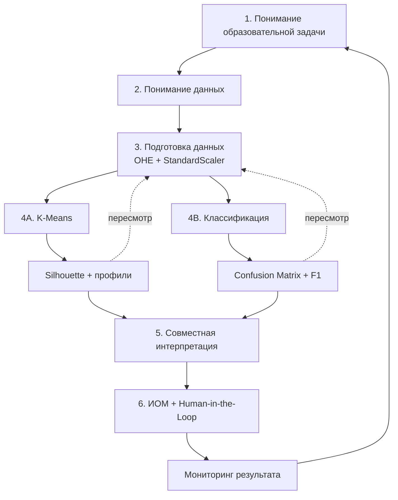
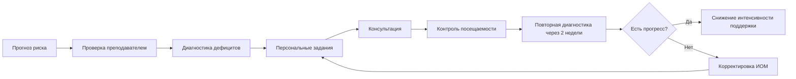

# Лабораторная работа № 2. Кластеризация учебных траекторий и прогнозирование академического риска

**Дисциплина:** «К.М.06.04 Методы анализа больших данных»  
**Профиль:** «Информатика и английский язык»  
**Трудоёмкость:** **10 академических часов**  
**Компетенция:** **ПК-1.2**  
**Среда:** Google Colab, Python 3.10+  
**Датасет:** UCI Student Performance, `student-mat.csv`  
**Разделитель:** `;`

> Основной URL из задания:
>
> `https://raw.githubusercontent.com/arunkumar-ramanan/student-performance-dataset/master/student-mat.csv`
>
> На момент подготовки файла этот адрес возвращает `404`. В эталонном ноутбуке он используется первым, после чего при ошибке автоматически подключается резервный прямой URL на тот же открытый UCI-файл:
>
> `https://raw.githubusercontent.com/sachanganesh/student-performance-prediction/refs/heads/master/data/student-mat.csv`

---

## Паспорт работы

### Цель

Освоить полный цикл интеллектуального анализа образовательных данных по CRISP-DM: выполнить предобработку смешанных признаков, кластеризацию K-Means, построить модель прогнозирования итогового результата `G3`, оценить качество классификации и преобразовать аналитические результаты в проект индивидуального образовательного маршрута.

### Задачи

1. Загрузить UCI Student Performance по HTTPS без ручной загрузки.
2. Разделить признаки на числовые и категориальные.
3. Выполнить One-Hot Encoding и StandardScaler.
4. Подобрать число кластеров по Elbow Method и Silhouette Analysis.
5. Интерпретировать профили кластеров.
6. Выделить группу повышенного педагогического внимания.
7. Построить классификатор своего варианта.
8. Рассчитать Confusion Matrix, Precision, Recall и $F_1$.
9. Интерпретировать Feature Importance.
10. Спроектировать ИОМ для прогнозируемой группы риска.

---

## Методология CRISP-DM в образовании



---

## Теоретический базис

### K-Means

$$
J = \sum_{j=1}^{k} \sum_{i=1}^{n} ||x_i^{(j)} - c_j||^2.
$$

Здесь $c_j$ — центроид кластера $j$.

### StandardScaler

$$
z=\frac{x-\mu}{\sigma}.
$$

Масштабирование необходимо, поскольку K-Means использует расстояния.

### Silhouette Score

$$
s(i) = \frac{b(i) - a(i)}{\max(a(i), b(i))}.
$$

Где $a(i)$ — среднее расстояние до объектов собственного кластера, $b(i)$ — минимальное среднее расстояние до объектов другого кластера.

### Бинарный риск

$$
risk=
\begin{cases}
1, & G3<10,\\
0, & G3\geq10.
\end{cases}
$$

### Многоклассовая градация

$$
class(G3)=
\begin{cases}
A, & 16\leq G3\leq20,\\
B, & 14\leq G3\leq15,\\
C, & 10\leq G3\leq13,\\
F, & 0\leq G3\leq9.
\end{cases}
$$

Это учебная шкала для данной лабораторной.

### Метрики классификации

$$
Accuracy = \frac{TP+TN}{TP+TN+FP+FN}.
$$

$$
Precision = \frac{TP}{TP+FP}.
$$

$$
Recall = \frac{TP}{TP+FN}.
$$

$$
F_1 = 2 \cdot \frac{P \cdot R}{P + R}.
$$

Для многоклассовой задачи:

$$
F_1^{macro}=\frac{1}{K}\sum_{k=1}^K F_{1,k}.
$$

---

## Общий алгоритм

1. Загрузить `student-mat.csv` с `sep=';'`.
2. Проверить структуру, `NaN`, дубликаты и диапазоны `G1–G3`.
3. Выбрать признаки кластеризации своего варианта.
4. Числовые признаки масштабировать, категориальные кодировать One-Hot.
5. Для $k=2..8$ вычислить `inertia_` и Silhouette Score.
6. Сопоставить Elbow Method, Silhouette и интерпретируемость кластеров.
7. Обучить итоговый K-Means.
8. Вернуться к исходным шкалам и построить профиль кластеров.
9. Определить кластер повышенного внимания по учебным признакам.
10. Создать целевую переменную классификации.
11. Исключить `G3` из входных признаков.
12. Выполнить стратифицированное `train_test_split`.
13. Обучить модель своего варианта.
14. Рассчитать Confusion Matrix и Classification Report.
15. Интерпретировать $F_1$ класса риска.
16. Построить Feature Importance.
17. Сформировать ИОМ и ограничения применения модели.

---

## Варианты заданий

| № | Набор признаков для кластеризации | Целевая переменная | Алгоритм | Гиперпараметры | Педагогический кейс: ИОМ |
|---:|---|---|---|---|---|
| 1 | `studytime`, `failures`, `G1`, `G2` | Бинарный риск: `G3 < 10` | Decision Tree | `max_depth=3`, `min_samples_leaf=8` | Диагностика дефицитов и еженедельный контроль. |
| 2 | `studytime`, `failures`, `absences`, `G1`, `G2` | Бинарный риск: `G3 < 10` | Logistic Regression | `C=0.5`, `class_weight='balanced'` | Контроль посещаемости и календарь контрольных точек. |
| 3 | `freetime`, `goout`, `Dalc`, `Walc`, `absences` | Градация `A/B/C/F` | Random Forest | `n_estimators=200`, `max_depth=6` | Саморегуляция учебного времени и мониторинг посещаемости. |
| 4 | `Medu`, `Fedu`, `famrel`, `famsize`, `Pstatus` | Бинарный риск: `G3 < 10` | KNN | `n_neighbors=9`, `weights='distance'` | Поддержка без социальных ярлыков, опора на доступные ресурсы. |
| 5 | `G1`, `G2`, `failures`, `schoolsup`, `paid` | Градация `A/B/C/F` | Decision Tree | `max_depth=5`, `min_samples_split=12` | Дифференцированные задания по текущим достижениям. |
| 6 | `studytime`, `higher`, `failures`, `G1`, `G2` | Бинарный риск: `G3 < 10` | Random Forest | `n_estimators=250`, `max_depth=5`, `class_weight='balanced'` | Мотивационный модуль и предметные консультации. |
| 7 | `absences`, `traveltime`, `freetime`, `goout`, `studytime` | Бинарный риск: `G3 < 10` | Logistic Regression | `C=1.0`, `class_weight='balanced'` | Планирование времени и контроль посещаемости. |
| 8 | `schoolsup`, `famsup`, `paid`, `internet`, `activities`, `G1` | Градация `A/B/C/F` | Random Forest | `n_estimators=300`, `max_depth=7` | Подбор бесплатных цифровых и очных форм поддержки. |
| 9 | `Medu`, `Fedu`, `studytime`, `failures`, `G1` | Бинарный риск: `G3 < 10` | Decision Tree | `max_depth=4`, `class_weight='balanced'` | Индивидуальные цели без выводов о способностях по семейным факторам. |
| 10 | `goout`, `Walc`, `absences`, `G1`, `G2` | Градация `A/B/C/F` | KNN | `n_neighbors=11`, `weights='distance'`, `p=2` | Анализ режима и регулярности учебной работы. |
| 11 | `studytime`, `failures`, `absences`, `G1` | Бинарный риск: `G3 < 10` | Logistic Regression | `C=0.2`, `class_weight='balanced'` | Раннее вмешательство после первого периода. |
| 12 | `school`, `reason`, `schoolsup`, `activities`, `internet`, `G1` | Градация `A/B/C/F` | Random Forest | `n_estimators=200`, `max_depth=8` | Маршрутизация к школьным ресурсам. |
| 13 | `famrel`, `famsup`, `Medu`, `Fedu`, `studytime`, `G1` | Бинарный риск: `G3 < 10` | KNN | `n_neighbors=7`, `weights='uniform'`, `p=1` | Подбор форм обратной связи и учебных ресурсов. |
| 14 | `freetime`, `goout`, `Dalc`, `Walc`, `health`, `absences` | Градация `A/B/C/F` | Decision Tree | `max_depth=4`, `min_samples_leaf=10` | Работа с учебным режимом без медицинских интерпретаций. |
| 15 | `studytime`, `internet`, `higher`, `G1`, `G2` | Бинарный риск: `G3 < 10` | Random Forest | `n_estimators=250`, `max_features='sqrt'`, `class_weight='balanced'` | Офлайн/онлайн ресурсы и задания разного уровня. |
| 16 | `absences`, `failures`, `schoolsup`, `G1`, `G2` | Градация `A/B/C/F` | Logistic Regression | `C=2.0`, `max_iter=2000` | Консультации и восстановление пропущенных тем. |
| 17 | `address`, `traveltime`, `goout`, `freetime`, `internet` | Бинарный риск: `G3 < 10` | Decision Tree | `max_depth=3`, `min_samples_leaf=12` | Реалистичный график и доступность ресурсов. |
| 18 | `G1`, `G2`, `studytime`, `failures`, `absences` | Бинарный риск: `G3 < 10` | KNN | `n_neighbors=5`, `weights='distance'`, `p=2` | Персональные задания по близким учебным профилям. |
| 19 | `schoolsup`, `famsup`, `paid`, `studytime`, `G1`, `G2` | Градация `A/B/C/F` | Random Forest | `n_estimators=400`, `max_depth=6`, `min_samples_leaf=2` | Сопоставление вида поддержки и учебного профиля. |
| 20 | `higher`, `studytime`, `activities`, `goout`, `absences`, `G1` | Бинарный риск: `G3 < 10` | Logistic Regression | `C=0.8`, `class_weight='balanced'` | Учебная цель, план недели и короткая обратная связь. |
| 21 | `studytime`, `failures`, `famsup`, `famrel`, `G1`, `G2` | Градация `A/B/C/F` | Decision Tree | `max_depth=6`, `min_samples_leaf=6` | Задания разной сложности и формирующее оценивание. |
| 22 | `school`, `reason`, `traveltime`, `studytime`, `G1`, `G2` | Бинарный риск: `G3 < 10` | Random Forest | `n_estimators=300`, `max_depth=5`, `class_weight='balanced_subsample'` | Адаптация графика и школьная поддержка. |
| 23 | `freetime`, `goout`, `absences`, `failures`, `G1`, `G2` | Градация `A/B/C/F` | KNN | `n_neighbors=13`, `weights='distance'`, `p=2` | Планирование нагрузки по профилю группы. |
| 24 | `studytime`, `failures`, `schoolsup`, `famsup`, `higher`, `internet`, `G1`, `G2` | Бинарный риск: `G3 < 10` | Logistic Regression | `C=1.5`, `class_weight='balanced'`, `max_iter=2000` | Комбинированная поддержка: контент, консультация, контроль. |
| 25 | `studytime`, `failures`, `absences`, `goout`, `Walc`, `famrel`, `higher`, `schoolsup`, `famsup`, `internet`, `G1`, `G2` | Бинарный риск: `G3 < 10` | Random Forest | `n_estimators=300`, `max_depth=6`, `min_samples_leaf=3`, `class_weight='balanced'` | Диагностика дефицитов, персональные задания, консультации и двухнедельный мониторинг. |

---

## ПРИМЕРНОЕ условие варианта № 25

### Кластеризация

Числовые признаки:

```text
studytime, failures, absences, goout, Walc, famrel, G1, G2
```

Категориальные:

```text
higher, schoolsup, famsup, internet
```

Предобработка:

- `StandardScaler` для числовых;
- `OneHotEncoder(handle_unknown="ignore")` для категориальных.

Подбор:

```text
k = 2..8
```

по Elbow Method и Silhouette Score.

### Профилирование

Для кластеров рассчитать:

- размер;
- средние `G1`, `G2`;
- медиану `absences`;
- средние `studytime`, `failures`, `goout`, `Walc`, `famrel`;
- долю `higher == yes`;
- доли `schoolsup == yes`, `famsup == yes`, `internet == yes`.

Фактическую долю `G3 < 10` использовать **только после кластеризации** как внешний показатель для проверки интерпретации.

### Классификация

Цель:

$$
risk=1 \Leftrightarrow G3<10.
$$

Алгоритм:

```python
RandomForestClassifier(
    n_estimators=300,
    max_depth=6,
    min_samples_leaf=3,
    class_weight="balanced",
    random_state=42
)
```

В признаки входят исходные информативные поля, кроме `G3`. `G1` и `G2` используются, поэтому сценарий — прогноз после второго периода.

---

## Педагогический кейс: ИОМ



| Компонент ИОМ | Содержание |
|---|---|
| Основание | Признаки, требующие педагогической проверки |
| Цель | Конкретный результат на 2 недели |
| Диагностика | Короткая диагностическая работа |
| Учебный контент | 2–3 персональных задания |
| Поддержка | Консультация / парная работа / цифровой ресурс |
| Посещаемость | План восстановления пропущенных тем |
| Контроль | Формирующее оценивание |
| Критерий прогресса | Измеримое улучшение |
| Пересмотр | Повторная оценка через 14 дней |

Недопустимо использовать риск-модель для автоматического снижения оценки, ограничения доступа к сложным заданиям или формулировок типа «неспособный ученик».

---

## Критерии оценивания

| Критерий | Баллы |
|---|---:|
| Предобработка, масштабирование и K-Means | **5** |
| Построение и обучение классификатора | **5** |
| Confusion Matrix, $F_1$ и интерпретация | **4** |
| Педагогический кейс: ИОМ | **4** |
| Защита и контрольные вопросы | **2** |
| **Итого** | **20** |

---

## Контрольные вопросы

1. Почему K-Means требует масштабирования?
2. Что означает `inertia_`?
3. Чем Elbow Method отличается от Silhouette Analysis?
4. Почему нельзя включать `G3` в признаки?
5. В каком сценарии допустимы `G1` и `G2`?
6. Почему Accuracy недостаточно при дисбалансе?
7. Почему `FN` особенно важен для Early Warning System?
8. Что Feature Importance не позволяет утверждать?
9. Почему кластер не следует называть «слабыми учениками»?
10. Почему ИОМ должен подтверждаться преподавателем?
