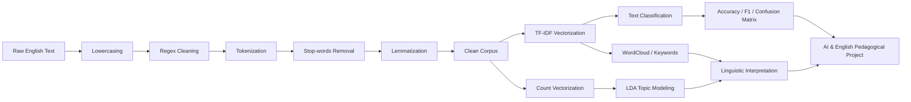
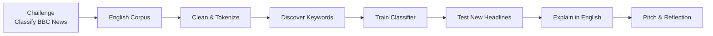

# Лабораторная работа № 3. NLP-анализ англоязычного корпуса и классификация новостных текстов

**Дисциплина:** «К.М.06.04 Методы анализа больших данных»  
**Междисциплинарный модуль:** **Информатика + Английский язык**  
**Среда выполнения:** Google Colab, Python 3.10+  
**Трудоёмкость:** **10 академических часов**  
**Исходный корпус:** BBC News Text Classification, `bbc-text.csv`

> **Основной URL из задания:**
>
> `https://raw.githubusercontent.com/susanli2016/Machine-Learning-with-Python/master/research/data/bbc-text.csv`
>
> На момент подготовки комплекта этот GitHub raw URL возвращает HTTP `404`. Для гарантированного запуска эталонного Colab-ноутбука предусмотрен автоматический резервный прямой URL на тот же открытый корпус:
>
> `https://storage.googleapis.com/download.tensorflow.org/data/bbc-text.csv`
>
> Исходный BBC-корпус содержит **2225 текстов и пять категорий**: `business`, `entertainment`, `politics`, `sport`, `tech`. Отдельной категории `education` в этом CSV нет.

---

## Паспорт работы

| Параметр | Содержание |
|---|---|
| Название | **Комплексная лабораторная работа № 3. NLP-анализ англоязычного корпуса и классификация новостных текстов** |
| Трудоёмкость | **10 академических часов** |
| Междисциплинарная область | Informatics & Applied English Linguistics |
| Формируемая компетенция | **ПК-1.2** — применение цифровых технологий и методов анализа данных в профессиональной и учебно-методической деятельности |
| Основные технологии | NLTK, pandas, scikit-learn, TF-IDF, LDA, WordCloud, text classification |
| Формат | Индивидуальная аналитическая работа + методический проект школьного хакатона |
| Итог | Colab-ноутбук, тематическая модель, классификатор, лингвистические выводы, сценарий «AI & English» |

### Междисциплинарная цель

Сформировать у будущего учителя способность соединять методы обработки текстовых данных с прикладной лингвистикой английского языка: подготавливать корпус, выделять тематическую лексику, строить числовое представление текста, обнаруживать скрытые темы и обучать алгоритм автоматической классификации.

### Цели в области информатики

Студент должен научиться:

- загружать и валидировать текстовый датасет;
- реализовывать воспроизводимый NLP-конвейер;
- выполнять токенизацию и нормализацию текста;
- представлять документы в виде TF-IDF-векторов;
- применять LDA для тематического моделирования;
- обучать и оценивать классификатор текста;
- интерпретировать Accuracy, macro-$F_1$ и матрицу ошибок.

### Цели в области Applied English Linguistics

Студент должен научиться:

- различать token, lemma, stop word, n-gram;
- анализировать тематическую лексику англоязычного корпуса;
- интерпретировать ключевые слова скрытых тем;
- объяснять лексические различия новостных регистров;
- формулировать выводы по-английски без подмены статистического результата лингвистическим фактом;
- проектировать междисциплинарную деятельность школьников.

---

## NLP-пайплайн



### Почему для LDA используется Count Vectorizer

TF-IDF применяется для классификации и анализа важности терминов. Классическая `LatentDirichletAllocation` в данной работе обучается на **частотной матрице документов**, полученной через `CountVectorizer`, поскольку вероятностная постановка LDA моделирует распределения слов в документах.

---

## Теоретический базис

### Токенизация

Пусть документ $d$ представлен последовательностью токенов:

$$
d=(w_1,w_2,\ldots,w_n).
$$

**Tokenization** — разбиение текстовой последовательности на единицы, с которыми далее работает алгоритм.

### Лемматизация

**Lemma** — нормальная словарная форма.

Пример:

```text
studies -> study
studying -> study
cars -> car
```

В лабораторной используется `WordNetLemmatizer`.

### Term Frequency

$$
TF(t,d)=
\frac{f_{t,d}}
{\sum_{t'\in d} f_{t',d}},
$$

где $f_{t,d}$ — число вхождений терма $t$ в документ $d$.

### Inverse Document Frequency

Используется сглаженный вариант:

$$
IDF(t,D)=
\ln\left(
\frac{1+|D|}
{1+|\{d\in D:t\in d\}|}
\right)+1.
$$

Чем в меньшем числе документов встречается термин, тем выше его потенциальная различительная способность.

### TF-IDF

Итоговый вес терма $t$ в документе $d$ определяется как произведение частоты терма и обратной частоты документа:

$$
TF\text{-}IDF(t,d,D) = TF(t,d)\times IDF(t,D)
$$

где:

- $TF(t,d)$ — частота терма $t$ в документе $d$;
- $IDF(t,D)$ — обратная документная частота терма $t$ в корпусе $D$.

В `scikit-learn` реализация `TfidfVectorizer` включает сглаживание, нормировку и дополнительные параметры вычисления весов, поэтому численные значения могут несколько отличаться от результата, полученного при непосредственном использовании базовой формулы.

### N-grams

Униграмма:

```text
artificial
```

Биграмма:

```text
artificial intelligence
```

Триграмма:

```text
prime minister said
```

Параметр:

```python
ngram_range=(1, 2)
```

означает использование униграмм и биграмм.

### Наивный Байесовский классификатор

Для документа $D$ и класса $C$:

$$
P(C|D)
\propto
P(C)
\prod_i P(w_i|C).
$$

Multinomial Naive Bayes предполагает условную независимость признаков при известном классе. Предположение упрощает реальный язык, но алгоритм остаётся сильной базовой моделью для разреженных текстовых признаков.

### Многоклассовые метрики

Accuracy:

$$
Accuracy=
\frac{N_{correct}}{N}.
$$

Для класса $k$:

$$
Precision_k=
\frac{TP_k}{TP_k+FP_k},
$$

$$
Recall_k=
\frac{TP_k}{TP_k+FN_k}.
$$


### Метрики многоклассовой классификации

Для каждого класса $k$ значение $F_1$ вычисляется как гармоническое среднее Precision и Recall:

$$
F_{1,k} = 2 \cdot \frac{Precision_k \cdot Recall_k}{Precision_k + Recall_k}
$$

Для оценки качества многоклассовой модели можно использовать $F_1^{macro}$:

$$
F_1^{macro} = \frac{1}{K}\sum_{k=1}^{K} F_{1,k}
$$

где $K$ — число классов.

$F_1^{macro}$ одинаково учитывает каждую категорию независимо от количества документов в ней, поэтому эта метрика особенно полезна при неравномерном распределении классов.

---

## Тематическое моделирование LDA

LDA предполагает, что:

1. каждый документ является смесью тем;
2. каждая тема является распределением вероятностей по словам.

Упрощённо:

Для модели LDA вероятность появления слова $w$ в документе $d$ можно представить как сумму вкладов скрытых тем:

$$
P(w \mid d) = \sum_{k=1}^{K} P(w \mid z=k)\,P(z=k \mid d)
$$

где:

- $K$ — число скрытых тем;
- $P(w \mid z=k)$ — вероятность слова $w$ в теме $k$;
- $P(z=k \mid d)$ — вероятность темы $k$ в документе $d$.
Тема интерпретируется по словам с наиболее высокими весами.

> Номер `Topic 0`, `Topic 1` и т. д. сам по себе не несёт семантики. Название темы формулирует исследователь после анализа ключевых слов.

---

## Общий алгоритм выполнения

1. Создать Colab-ноутбук и указать вариант.
2. Установить и импортировать `nltk`, `scikit-learn`, `wordcloud`, `matplotlib`.
3. Автоматически загрузить NLTK-ресурсы `punkt`, `stopwords`, `wordnet`; дополнительно загрузить ресурсы для POS-tagging.
4. Загрузить `bbc-text.csv` по HTTPS.
5. Проверить `shape`, `category`, пропуски, дубликаты.
6. Оставить только категории своего варианта.
7. Выполнить lowercasing.
8. Удалить URL, числа и лишние символы Regex-правилами.
9. Выполнить токенизацию.
10. Удалить английские stop words.
11. Выполнить лемматизацию.
12. Сохранить очищенный текст в отдельном столбце `clean_text`.
13. Выполнить стратифицированное `train_test_split`.
14. Обучить `TfidfVectorizer` **только на train-части**.
15. Построить WordCloud по условиям варианта.
16. Для LDA создать отдельную count-матрицу.
17. Обучить LDA с заданным $K$.
18. Вывести 10–12 ключевых слов каждой темы.
19. Дать каждой теме содержательное английское название.
20. Обучить классификатор своего варианта.
21. Рассчитать Accuracy, macro-$F_1$, Classification Report и Confusion Matrix.
22. Проанализировать минимум 5 ошибок классификации.
23. Проверить модель на новом английском предложении.
24. Сформулировать лингвистический вывод.
25. Разработать сценарий школьного хакатона «AI & English».

---

## Индивидуальные варианты

| № варианта | Анализируемые англоязычные категории | Параметры TF-IDF | Параметры LDA | Алгоритм классификации | Педагогическое задание: хакатон «AI & English» |
|---:|---|---|---|---|---|
| 1 | `tech`, `business` | `ngram_range=(1,1)`, `max_features=6000`, `min_df=2` | $K=3$ | MultinomialNB | «AI News Detective»: различение технологической и деловой лексики. |
| 2 | `sport`, `entertainment` | `ngram_range=(1,2)`, `max_features=7000`, `min_df=2` | $K=3$ | LinearSVC | «Sports or Showbiz?»: автоматическая тематизация новостных заголовков. |
| 3 | `politics`, `business` | `ngram_range=(1,2)`, `max_features=8000`, `min_df=3` | $K=4$ | LogisticRegression | «Policy & Economy»: язык политики и экономики в англоязычных СМИ. |
| 4 | `tech`, `sport` | `ngram_range=(1,1)`, `max_features=6500`, `min_df=2` | $K=4$ | MultinomialNB | «Vocabulary Classifier»: тематические словари спорта и технологий. |
| 5 | `entertainment`, `politics` | `ngram_range=(1,2)`, `max_features=7500`, `min_df=2` | $K=4$ | LinearSVC | «Headline Challenge»: классификация медийных и политических новостей. |
| 6 | `business`, `sport`, `tech` | `ngram_range=(1,2)`, `max_features=9000`, `min_df=2` | $K=4$ | LogisticRegression | «Three Worlds of English»: сравнение терминологии трёх предметных областей. |
| 7 | `business`, `politics`, `entertainment` | `ngram_range=(1,2)`, `max_features=9000`, `min_df=3` | $K=5$ | MultinomialNB | «Media Language Lab»: тематическая лексика общественных новостей. |
| 8 | `sport`, `tech`, `entertainment` | `ngram_range=(1,2)`, `max_features=10000`, `min_df=2` | $K=5$ | LinearSVC | «Topic Race»: какая лексика лучше разделяет три новостные рубрики. |
| 9 | `politics`, `sport`, `business` | `ngram_range=(1,1)`, `max_features=7000`, `min_df=3` | $K=4$ | LogisticRegression | «English Data Journalism»: тематизация новостного корпуса. |
| 10 | `tech`, `business`, `politics` | `ngram_range=(1,2)`, `max_features=11000`, `min_df=2` | $K=5$ | LinearSVC | «AI Media Monitor»: классификация технологических, деловых и политических текстов. |
| 11 | `business`, `entertainment`, `sport`, `tech` | `ngram_range=(1,2)`, `max_features=11000`, `min_df=2` | $K=5$ | MultinomialNB | «BBC Topic Bot»: бот-классификатор четырёх рубрик. |
| 12 | `politics`, `entertainment`, `sport`, `business` | `ngram_range=(1,2)`, `max_features=12000`, `min_df=3` | $K=5$ | LogisticRegression | «Newsroom AI»: автоматическое распределение материалов по редакционным рубрикам. |
| 13 | `tech`, `politics`, `sport`, `entertainment` | `ngram_range=(1,2)`, `max_features=10000`, `min_df=2` | $K=6$ | LinearSVC | «Language of News»: тематические маркеры в четырёх доменах. |
| 14 | `tech`, `business`, `politics`, `sport` | `ngram_range=(1,3)`, `max_features=12000`, `min_df=3` | $K=5$ | LogisticRegression | «N-gram Explorer»: роль устойчивых словосочетаний при классификации. |
| 15 | `business`, `tech`, `entertainment` | `ngram_range=(1,3)`, `max_features=10000`, `min_df=2` | $K=4$ | MultinomialNB | «Keyword vs Context»: униграммы и биграммы в тематическом анализе. |
| 16 | `politics`, `business`, `tech`, `entertainment` | `ngram_range=(1,2)`, `max_features=14000`, `min_df=2` | $K=6$ | LinearSVC | «Smart News Desk»: интеллектуальная сортировка англоязычных материалов. |
| 17 | `sport`, `business`, `politics`, `tech` | `ngram_range=(1,2)`, `max_features=13000`, `min_df=3` | $K=6$ | LogisticRegression | «Explain the Topic»: объяснение решения классификатора через ключевые термины. |
| 18 | Все 5 категорий | `ngram_range=(1,1)`, `max_features=8000`, `min_df=2` | $K=5$ | MultinomialNB | «BBC Mini Classifier»: базовый классификатор пяти новостных рубрик. |
| 19 | Все 5 категорий | `ngram_range=(1,2)`, `max_features=10000`, `min_df=2` | $K=5$ | LogisticRegression | «AI & English News Lab»: классификация и анализ ошибок модели. |
| 20 | Все 5 категорий | `ngram_range=(1,2)`, `max_features=12000`, `min_df=3` | $K=6$ | LinearSVC | «Topic Discovery»: сравнение скрытых LDA-тем и исходных рубрик. |
| 21 | Все 5 категорий | `ngram_range=(1,3)`, `max_features=15000`, `min_df=3` | $K=7$ | LogisticRegression | «Phrase Mining»: устойчивые словосочетания как признаки новостной категории. |
| 22 | Все 5 категорий | `ngram_range=(1,2)`, `max_features=15000`, `min_df=4` | $K=5$ | MultinomialNB | «English Corpus Challenge»: создание словаря ключевых терминов категорий. |
| 23 | Все 5 категорий | `ngram_range=(1,2)`, `max_features=16000`, `min_df=2` | $K=6$ | LinearSVC | «Human vs AI»: сравнение ручной и автоматической классификации новостей. |
| 24 | Все 5 категорий | `ngram_range=(1,3)`, `max_features=18000`, `min_df=3` | $K=7$ | LogisticRegression | «Media Topic Map»: карта тематических областей англоязычного корпуса. |
| 25 | Все 5 категорий: `business`, `entertainment`, `politics`, `sport`, `tech` | `ngram_range=(1,2)`, `max_features=12000`, `min_df=2` | $K=5$ | LinearSVC | «AI & English Newsroom»: команды создают NLP-конвейер, классификатор BBC News и объясняют тематические маркеры на английском языке. |

---

## Подробное условие варианта № 25

### Корпус

Использовать все пять категорий:

```text
business
entertainment
politics
sport
tech
```

### NLP-предобработка

Обязательно:

- lowercasing;
- Regex cleaning;
- `nltk.word_tokenize`;
- английские `stopwords`;
- POS-aware `WordNetLemmatizer`;
- удаление токенов короче 3 символов.

### TF-IDF

```python
TfidfVectorizer(
    ngram_range=(1, 2),
    max_features=12000,
    min_df=2,
    sublinear_tf=True
)
```

### LDA

$$
K=5.
$$

Для LDA использовать:

```python
CountVectorizer(
    max_features=8000,
    min_df=3,
    max_df=0.95
)
```

### Классификатор

```python
LinearSVC(C=1.0)
```

### Обязательные метрики

- Accuracy;
- macro-$F_1$;
- Classification Report;
- Confusion Matrix.

### Тестовое предложение

Проверить классификатор минимум на одном новом тексте, например:

```text
The company announced a new smartphone platform and plans to expand its digital services next year.
```

Студент должен объяснить, почему фраза может содержать признаки сразу нескольких рубрик.

---

## Лингвистическая интерпретация

Для каждой LDA-темы заполнить:

| Topic | Top words | Proposed English label | Лингвистический комментарий |
|---|---|---|---|
| Topic 0 | ... | ... | Какие семантические поля доминируют |
| Topic 1 | ... | ... | Какие устойчивые тематические маркеры видны |
| Topic 2 | ... | ... | Как тема соотносится с BBC category |
| Topic 3 | ... | ... | Есть ли смешение нескольких рубрик |
| Topic 4 | ... | ... | Какие слова требуют контекстной проверки |

Важно:

$$
\text{LDA topic} \neq \text{BBC category}
$$

Скрытые темы обнаруживаются алгоритмом и не обязаны совпадать с редакционными метками.

---

## Методический проект «AI & English»

### Хакатон варианта № 25: «AI & English Newsroom»

**Целевая аудитория:** 10–11 классы.  
**Продолжительность:** 2–3 учебных занятия или внеурочный модуль.  
**Формат:** команды по 3–4 человека.



### Роли в команде

- **Data Engineer** — загрузка и проверка данных;
- **NLP Engineer** — предобработка и векторизация;
- **Language Analyst** — интерпретация ключевых слов и тем;
- **Presenter** — английская презентация результата.

### Итоговый продукт школьной команды

1. рабочий классификатор;
2. WordCloud;
3. 3–5 ключевых тематических признаков;
4. тест на новых заголовках;
5. двухминутный `English pitch`.

### Пример проблемного вопроса

> **Can an algorithm understand a news topic, or does it only recognize statistical patterns in words?**

### Предметные результаты по информатике

Школьник:

- объясняет принцип text preprocessing;
- строит признаки из текста;
- запускает классификатор;
- интерпретирует матрицу ошибок.

### Результаты по английскому языку

Школьник:

- выделяет тематическую лексику;
- сравнивает lexical fields;
- объясняет результаты модели на английском языке;
- различает слово, лемму, биграмму и тематический маркер.

---

## Критерии оценивания

| Критерий | Баллы |
|---|---:|
| Корректность предобработки англоязычного текста: NLTK, токенизация, лемматизация, stop words | **5** |
| TF-IDF, LDA, WordCloud и интерпретация топиков | **5** |
| Обучение и оценка качества текстового классификатора | **4** |
| Методический проект хакатона «AI & English» | **4** |
| Оформление Colab-ноутбука и лингвистические выводы | **2** |
| **Итого** | **20** |

---

## Контрольные вопросы

1. Чем token отличается от lemma?
2. Зачем удалять stop words?
3. Всегда ли stop-word removal полезен?
4. Чем unigram отличается от bigram?
5. Как интерпретируется высокий IDF?
6. Почему TF-IDF нельзя обучать на полном датасете до `train_test_split`?
7. Почему LDA в этой работе использует count-матрицу, а не TF-IDF?
8. Почему LDA-topic не обязан совпадать с BBC-category?
9. Как интерпретируется macro-$F_1$?
10. Какие типы слов чаще вызывают ошибки классификации?
11. Что LinearSVC фактически «понимает» в тексте?
12. Почему лингвистическая интерпретация должна выполняться человеком?

---

## Требования к отчету

Студент предоставляет:

1. воспроизводимый `.ipynb` или ссылку на Google Colab;
2. полностью программную загрузку корпуса;
3. реализацию NLP-функции очистки;
4. TF-IDF по параметрам варианта;
5. WordCloud;
6. таблицу LDA-топиков;
7. обученный классификатор;
8. Accuracy, macro-$F_1$, Classification Report и Confusion Matrix;
9. пример классификации нового текста;
10. лингвистический вывод;
11. сценарий междисциплинарного хакатона.
