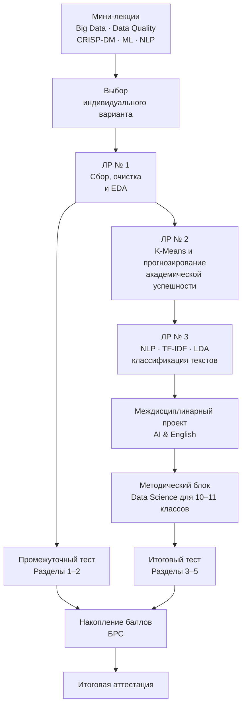

# К.М.06.04 «Методы анализа больших данных»

[](https://www.python.org/)
[](https://colab.research.google.com/)
[](https://moodle.org/)
[](https://opensource.org/licenses/MIT)

**ГАОУ ВО МГПУ, Институт цифрового образования**

**Направление подготовки:** 44.03.05 «Педагогическое образование (с двумя профилями подготовки)»  
**Профиль:** «Информатика и английский язык»  
**Семестр:** 7  
**Объём дисциплины:** 108 часов / 3 з.е.  
**Компетенция:** **ПК-1.2** — способен использовать в профессиональной деятельности научные знания о предмете, ключевые понятия, методы и приёмы предметной области.

## О дисциплине

Курс посвящён методам сбора, предобработки, интеллектуального анализа и интерпретации больших данных в образовательной среде. Особое внимание уделяется **Educational Data Mining**, **Learning Analytics**, анализу цифрового образовательного следа, методологии **CRISP-DM**, кластеризации и прогнозированию академической успешности.

Междисциплинарная часть курса связывает информатику с английским языком: студенты осваивают обработку англоязычных корпусов, **NLP**, **TF-IDF**, тематическое моделирование и классификацию текстов. Завершающий методический компонент ориентирован на проектирование занятий и учебных проектов по **Data Science и ИИ для школьников 10–11 классов**.

## Материалы курса

### Теоретический блок

| № | Материал | Ссылка |
|---:|---|---|
| 1 | Концепция Big Data и Learning Analytics в образовании | [Лекция 1](2026/lectures/lecture_01.md) |
| 2 | Жизненный цикл учебных данных: сбор, верификация и предобработка | [Лекция 2](2026/lectures/lecture_02.md) |
| 3 | Методология CRISP-DM и интеллектуальный анализ образовательных данных | [Лекция 3](2026/lectures/lecture_03.md) |
| 4 | Прикладное машинное обучение и NLP для лингводидактики | [Лекция 4](2026/lectures/lecture_04.md) |

### Лабораторный практикум

| № | Лабораторная работа | Ссылка |
|---:|---|---|
| 1 | Предобработка и разведочный анализ образовательных данных | [Лабораторная работа № 1](2026/lw/lw_01/lw_01.md) |
| 2 | Кластеризация учебных траекторий и прогнозирование академического риска | [Лабораторная работа № 2](2026/lw/lw_02/lw_02.md) |
| 3 | NLP-анализ англоязычного корпуса и классификация новостных текстов | [Лабораторная работа № 3](2026/lw/lw_03/lw_03.md) |

## Дорожная карта обучения



## Балльно-рейтинговая система

### Распределение баллов

| Вид учебной деятельности | Баллы |
|---|---:|
| **Лабораторный практикум** | **60** |
| Лабораторная работа № 1 «Сбор, инженерия и разведочный анализ данных» | 20 |
| Лабораторная работа № 2 «Data Mining и прогнозирование академической успешности» | 20 |
| Лабораторная работа № 3 «NLP и тематическое моделирование англоязычных текстов» | 20 |
| **Тестирование в LMS Moodle** | **40** |
| Промежуточный тест — разделы 1–2 | 15 |
| Итоговый тест — разделы 3–5 | 25 |
| **ИТОГО** | **100** |

### Шкала перевода баллов

| Сумма баллов | Академическая оценка | Результат |
|---:|---|---|
| 85–100 | «Отлично» | Зачтено |
| 70–84 | «Хорошо» | Зачтено |
| 50–69 | «Удовлетворительно» | Зачтено |
| 0–49 | — | Незачтено |

## Quick Start

### 1. Определите индивидуальный вариант

Номер варианта вычисляется по номеру студента в журнале:

$$
N_{variant} = (N_{journal} - 1) \pmod{25} + 1
$$

Полученное значение всегда находится в диапазоне от 1 до 25.

Примеры:

- номер 1 в журнале → вариант 1;
- номер 25 → вариант 25;
- номер 26 → вариант 1;
- номер 30 → вариант 5.

### 2. Изучите теоретический материал

Перед выполнением лабораторных работ последовательно изучите:

1. [Лекцию 1](2026/lectures/lecture_01.md);
2. [Лекцию 2](2026/lectures/lecture_02.md);
3. [Лекцию 3](2026/lectures/lecture_03.md);
4. [Лекцию 4](2026/lectures/lecture_04.md).

### 3. Перейдите к лабораторной работе

- [Лабораторная работа № 1](2026/lw/lw_01/lw_01.md)
- [Лабораторная работа № 2](2026/lw/lw_02/lw_02.md)
- [Лабораторная работа № 3](2026/lw/lw_03/lw_03.md)

Каждая работа содержит 25 индивидуальных вариантов и единые требования к анализу, визуализации, интерпретации результатов и педагогическому заданию.

### 4. Запуск в Google Colab

Для работы с Jupyter Notebook можно открыть репозиторий через Google Colab:

[](https://colab.research.google.com/github/BosenkoTM/Big-data-analysis-methods/)

Для конкретного `.ipynb` используется стандартная схема ссылки:

```text
https://colab.research.google.com/github/BosenkoTM/Big-data-analysis-methods/blob/main/<путь-к-файлу>.ipynb
```

Код лабораторных работ должен быть воспроизводимым в **Google Colab / Python 3.10+**. Исходные датасеты загружаются программно по открытым URL или средствами используемых библиотек; ручная локальная загрузка исходных данных не должна быть необходимой частью решения.

### 5. Требования к отчёту

Отчёт по лабораторной работе оформляется непосредственно в Jupyter/Colab Notebook и должен содержать:

- ФИО, учебную группу и номер индивидуального варианта;
- формулировку цели и исследовательской задачи;
- полностью выполняемый Python-код;
- результаты предобработки и проверки качества данных;
- статистические показатели и необходимые визуализации;
- интерпретацию результатов без необоснованных причинно-следственных выводов;
- ответы на вопросы индивидуального варианта;
- итоговые выводы;
- педагогический блок для применения изученного метода в 10–11 классах.

### 6. Защита педагогического задания

При защите студент должен:

- кратко объяснить применённый метод анализа данных;
- показать основные результаты и визуализации;
- обосновать интерпретацию полученных метрик;
- продемонстрировать, как материал можно адаптировать для школьного курса информатики или интегрированного занятия «Информатика + английский язык»;
- объяснить ограничения алгоритма и требования к ответственному использованию образовательных данных.

## Рекомендуемая литература и источники

### Основная литература

1. Миркин, Б. Г. **Базовые методы анализа данных : учебник и практикум для вузов** / Б. Г. Миркин. — 3-е изд., перераб. и доп. — Москва : Издательство Юрайт, 2026. — 297 с. — [ЭБС «Юрайт»](https://urait.ru/bcode/583143).

2. **Анализ данных : учебник для вузов** / под ред. В. С. Мхитаряна. — Москва : Издательство Юрайт, 2026. — 448 с. — [ЭБС «Юрайт»](https://urait.ru/bcode/583032).

3. Платонов, А. В. **Машинное обучение : учебное пособие для вузов** / А. В. Платонов. — 2-е изд. — Москва : Издательство Юрайт, 2026. — 89 с. — [ЭБС «Юрайт»](https://urait.ru/bcode/589132).

4. Федоров, Д. Ю. **Программирование на Python : учебник для вузов** / Д. Ю. Федоров. — 6-е изд., перераб. и доп. — Москва : Издательство Юрайт, 2026. — 166 с. — [ЭБС «Юрайт»](https://urait.ru/bcode/600874).

### Дополнительная и профильная литература

5. Leskovec, J., Rajaraman, A., Ullman, J. D. **Mining of Massive Datasets**. — Cambridge University Press. — [Официальный сайт учебника](http://www.mmds.org/).

6. Bird, S., Klein, E., Loper, E. **Natural Language Processing with Python**. — O'Reilly Media. — [NLTK Book](https://www.nltk.org/book/).

7. Romero, C., Ventura, S. **Educational Data Mining and Learning Analytics: An Updated Survey** // *WIREs Data Mining and Knowledge Discovery*. — DOI: 10.1002/widm.1355. — [Wiley Online Library](https://wires.onlinelibrary.wiley.com/doi/10.1002/widm.1355).

8. **Scikit-learn User Guide: Machine Learning in Python**. — [Официальная документация](https://scikit-learn.org/stable/user_guide.html).

## Лицензия

Материалы репозитория распространяются на условиях **MIT License**, если для отдельных внешних датасетов, публикаций или программных компонентов не указаны иные условия использования.
